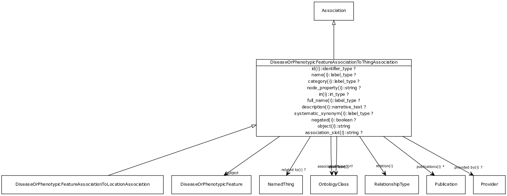

# Class: disease or phenotypic feature association to thing association

URI: [http://bioentity.io/vocab/DiseaseOrPhenotypicFeatureAssociationToThingAssociation](http://bioentity.io/vocab/DiseaseOrPhenotypicFeatureAssociationToThingAssociation)

## Mappings

## Inheritance

 *  is_a: [association](Association.md) - A typed association between two entities, supported by evidence
## Children

 *  child: [disease or phenotypic feature association to location association](DiseaseOrPhenotypicFeatureAssociationToLocationAssociation.md) - An association between either a disease or a phenotypic feature and an anatomical entity, where the disease/feature manifests in that site.
## Used in

 *  class: [disease or phenotypic feature association to thing association](DiseaseOrPhenotypicFeatureAssociationToThingAssociation.md) references: [disease or phenotypic feature association to location association](DiseaseOrPhenotypicFeatureAssociationToLocationAssociation.md)
## Fields

 * _[subject](subject.md)_
    * _connects an association to the subject of the association. For example, in a gene-to-phenotype association, the gene is subject and phenotype is object._
    * range: [disease or phenotypic feature](DiseaseOrPhenotypicFeature.md) [required]
    * Example: [MONDO:0017314](http://purl.obolibrary.org/obo/MONDO_0017314) Ehlers-Danlos syndrome, vascular type
    * Example: [MP:0013229](http://purl.obolibrary.org/obo/MP_0013229) abnormal brain ventricle size
    * __Local__
 * _[related to](related_to.md)_
    * _A grouping for any relationship type that holds between any two things_
    * range: [named thing](NamedThing.md)
    * inherited from: [named thing](NamedThing.md)
 * _[association type](association_type.md)_
    * _connects an association to the type of association (e.g. gene to phenotype)_
    * range: [ontology class](OntologyClass.md)
    * inherited from: None
 * _[relation](relation.md)_
    * _the relationship type by which a subject is connected to an object in an association_
    * range: [relationship type](RelationshipType.md) [required]
    * inherited from: None
 * _[qualifiers](qualifiers.md)_
    * _connects an association to qualifiers that modify or qualify the meaning of that association_
    * range: [ontology class](OntologyClass.md)*
    * inherited from: None
 * _[publications](publications.md)_
    * _connects an association to publications supporting the association_
    * range: [publication](Publication.md)*
    * inherited from: None
 * _[provided by](provided_by.md)_
    * _connects an association to the agent (person, organization or group) that provided it_
    * range: [provider](Provider.md)
    * inherited from: None
