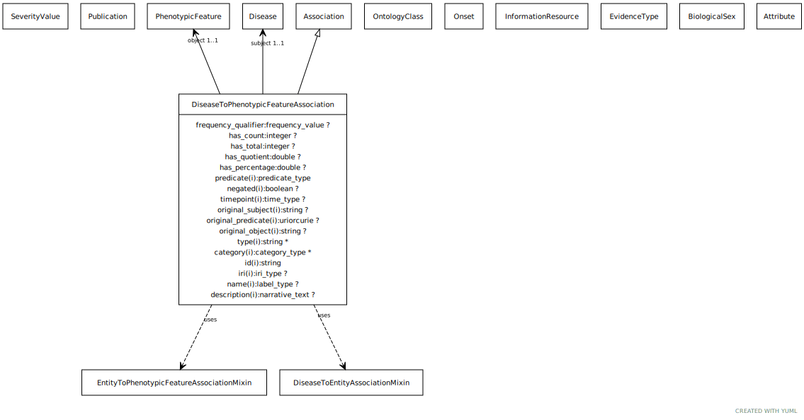

# Type: disease to phenotypic feature association

An association between a disease and a phenotypic feature in which the phenotypic feature is associated with the disease in some way

URI: [biolink:DiseaseToPhenotypicFeatureAssociation](https://w3id.org/biolink/vocab/DiseaseToPhenotypicFeatureAssociation)

## Parents

 *  is_a: [Association](Association.md) - A typed association between two entities, supported by evidence

## Uses Mixins

 *  mixin: [EntityToPhenotypicFeatureAssociation](EntityToPhenotypicFeatureAssociation.md)
 *  mixin: [DiseaseToThingAssociation](DiseaseToThingAssociation.md)

## Attributes

### Inherited from association:

 * [association type](association_type.md)  OPT
    * Description: connects an association to the type of association (e.g. gene to phenotype)
    * range: [OntologyClass](OntologyClass.md)
 * [association➞id](association_id.md)  REQ
    * Description: A unique identifier for an association
    * range: [String](types/String.md)
    * in subsets: (translator_minimal)
 * [negated](negated.md)  OPT
    * Description: if set to true, then the association is negated i.e. is not true
    * range: [Boolean](types/Boolean.md)
 * [object](object.md)  REQ
    * Description: connects an association to the object of the association. For example, in a gene-to-phenotype association, the gene is subject and phenotype is object.
    * range: [NamedThing](NamedThing.md)
 * [provided by](provided_by.md)  0..*
    * Description: connects an association to the agent (person, organization or group) that provided it
    * range: [Provider](Provider.md)
 * [publications](publications.md)  0..*
    * Description: connects an association to publications supporting the association
    * range: [Publication](Publication.md)
 * [qualifiers](qualifiers.md)  0..*
    * Description: connects an association to qualifiers that modify or qualify the meaning of that association
    * range: [OntologyClass](OntologyClass.md)
 * [relation](relation.md)  REQ
    * Description: The relation which describes an association between a subject and an object in a more granular manner. Usually this is a term from Relation Ontology, but it can be any edge CURIE.
    * range: [Uriorcurie](types/Uriorcurie.md)
 * [subject](subject.md)  REQ
    * Description: connects an association to the subject of the association. For example, in a gene-to-phenotype association, the gene is subject and phenotype is object.
    * range: [NamedThing](NamedThing.md)

### Mixed in from entity to phenotypic feature association:

 * [entity to phenotypic feature association➞description](entity_to_phenotypic_feature_association_description.md)  OPT
    * Description: A description of specific aspects of this phenotype, not otherwise covered by the phenotype ontology class
    * range: [NarrativeText](types/NarrativeText.md)

### Mixed in from entity to phenotypic feature association:

 * [sex qualifier](sex_qualifier.md)  OPT
    * Description: a qualifier used in a phenotypic association to state whether the association is specific to a particular sex.
    * range: [BiologicalSex](BiologicalSex.md)
