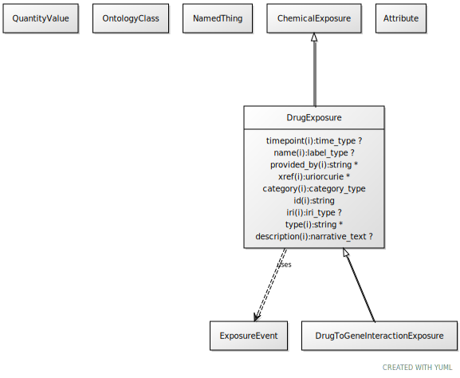

# Type: drug exposure

A drug exposure is an intake of a particular chemical substance

URI: [biolink:DrugExposure](https://w3id.org/biolink/vocab/DrugExposure)

## Parents

 *  is_a: [ChemicalExposure](ChemicalExposure.md) - A chemical exposure is an intake of a particular chemical substance

## Referenced by class

 *  **[Treatment](Treatment.md)** *[treatment➞has part](treatment_has_part.md)*  1..*  **[DrugExposure](DrugExposure.md)**

## Attributes

### Own

 * [drug exposure➞has drug](drug_exposure_has_drug.md)  1..*
    * range: [ChemicalSubstance](ChemicalSubstance.md)

### Inherited from chemical exposure:

 * [category](category.md)  1..*
    * Description: Name of the high level ontology class in which this entity is categorized. Corresponds to the label for the biolink entity type class. In a neo4j database this MAY correspond to the neo4j label tag
    * range: [CategoryType](types/CategoryType.md)
    * in subsets: (translator_minimal)
 * [id](id.md)  REQ
    * Description: A unique identifier for a thing. Must be either a CURIE shorthand for a URI or a complete URI
    * range: [String](types/String.md)
    * in subsets: (translator_minimal)
 * [name](name.md)  REQ
    * Description: A human-readable name for a thing
    * range: [LabelType](types/LabelType.md)
    * in subsets: (translator_minimal)

## Other properties

|  |  |  |
| --- | --- | --- |
| **Aliases:** | | drug intake |
|  | | drug dose |
| **Mappings:** | | ECTO:0000509 |
|  | | SIO:001005 |

