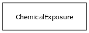

# Class: drug exposure

A drug exposure is an intake of a particular chemical substance

URI: [http://bioentity.io/vocab/DrugExposure](http://bioentity.io/vocab/DrugExposure)

## Mappings

 * [ECTO:0000509](http://purl.obolibrary.org/obo/ECTO_0000509)
 * [SIO:001005](http://semanticscience.org/resource/SIO_001005)
## Inheritance

 *  is_a: [environment](Environment.md) - A feature of the environment of an organism that influences one or more phenotypic features of that organism, potentially mediated by genes
## Children

## Used in

## Fields

 * _[drug](drug.md)_
    * range: [chemical substance](ChemicalSubstance.md)* [required]
    * __Local__
 * _[related to](related_to.md)_
    * _A grouping for any relationship type that holds between any two things_
    * range: [named thing](NamedThing.md)
    * inherited from: [named thing](NamedThing.md)
