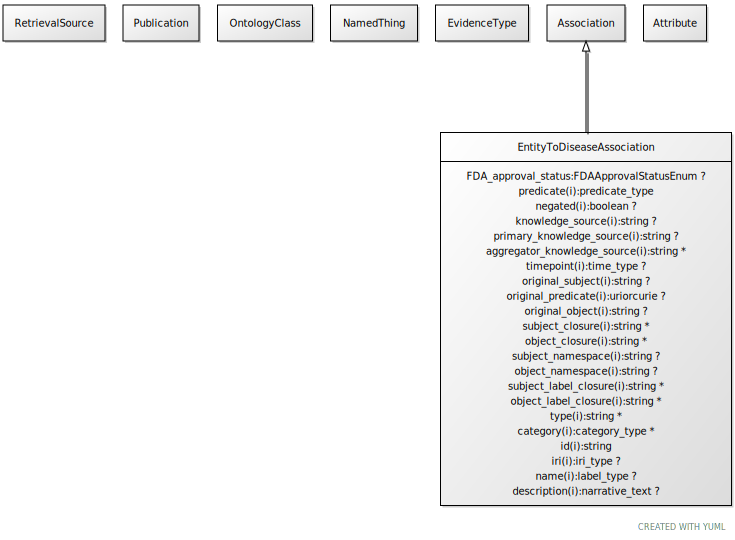

# Type: entity to disease association

mixin class for any association whose object (target node) is a disease

URI: [biolink:EntityToDiseaseAssociation](https://w3id.org/biolink/vocab/EntityToDiseaseAssociation)

## Parents

 *  is_a: [EntityToFeatureOrDiseaseQualifiers](EntityToFeatureOrDiseaseQualifiers.md) - Qualifiers for entity to disease or phenotype associations

## Mixin for

 * [CellLineAsAModelOfDiseaseAssociation](CellLineAsAModelOfDiseaseAssociation.md) (mixin) 
 * [GeneAsAModelOfDiseaseAssociation](GeneAsAModelOfDiseaseAssociation.md) (mixin) 
 * [GeneToDiseaseAssociation](GeneToDiseaseAssociation.md) (mixin) 
 * [GenotypeAsAModelOfDiseaseAssociation](GenotypeAsAModelOfDiseaseAssociation.md) (mixin) 
 * [GenotypeToDiseaseAssociation](GenotypeToDiseaseAssociation.md) (mixin) 
 * [OrganismalEntityAsAModelOfDiseaseAssociation](OrganismalEntityAsAModelOfDiseaseAssociation.md) (mixin) 
 * [VariantAsAModelOfDiseaseAssociation](VariantAsAModelOfDiseaseAssociation.md) (mixin) 
 * [VariantToDiseaseAssociation](VariantToDiseaseAssociation.md) (mixin) 

## Referenced by class

## Attributes

### Own

 * [entity to disease association➞object](entity_to_disease_association_object.md)  REQ
    * Description: disease
    * range: [Disease](Disease.md)
    * Example:    

### Inherited from entity to feature or disease qualifiers:

 * [frequency qualifier](frequency_qualifier.md)  OPT
    * Description: a qualifier used in a phenotypic association to state how frequent the phenotype is observed in the subject
    * range: [FrequencyValue](FrequencyValue.md)
 * [onset qualifier](onset_qualifier.md)  OPT
    * Description: a qualifier used in a phenotypic association to state when the phenotype appears is in the subject
    * range: [Onset](Onset.md)
 * [severity qualifier](severity_qualifier.md)  OPT
    * Description: a qualifier used in a phenotypic association to state how severe the phenotype is in the subject
    * range: [SeverityValue](SeverityValue.md)
