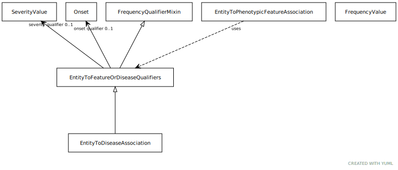

# Type: entity to feature or disease qualifiers

Qualifiers for entity to disease or phenotype associations

URI: [biolink:EntityToFeatureOrDiseaseQualifiers](https://w3id.org/biolink/vocab/EntityToFeatureOrDiseaseQualifiers)

## Parents

 *  is_a: [FrequencyQualifierMixin](FrequencyQualifierMixin.md) - Qualifier for frequency type associations

## Children

 * [EntityToDiseaseAssociation](EntityToDiseaseAssociation.md) - mixin class for any association whose object (target node) is a disease

## Mixin for

 * [EntityToPhenotypicFeatureAssociation](EntityToPhenotypicFeatureAssociation.md) (mixin) 

## Referenced by class

## Attributes

### Own

 * [onset qualifier](onset_qualifier.md)  OPT
    * Description: a qualifier used in a phenotypic association to state when the phenotype appears is in the subject
    * range: [Onset](Onset.md)
 * [severity qualifier](severity_qualifier.md)  OPT
    * Description: a qualifier used in a phenotypic association to state how severe the phenotype is in the subject
    * range: [SeverityValue](SeverityValue.md)

### Inherited from frequency qualifier mixin:

 * [frequency qualifier](frequency_qualifier.md)  OPT
    * Description: a qualifier used in a phenotypic association to state how frequent the phenotype is observed in the subject
    * range: [FrequencyValue](FrequencyValue.md)
