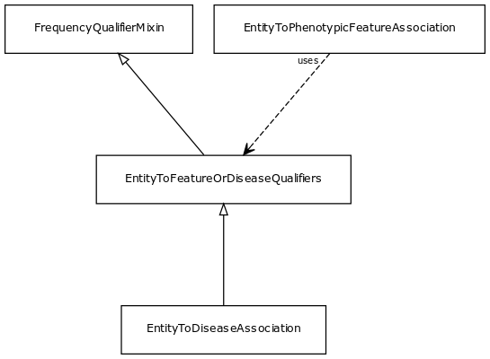

# Class: entity to feature or disease qualifiers

Qualifiers for entity to disease or phenotype associations

URI: [biolink:EntityToFeatureOrDiseaseQualifiers](https://w3id.org/biolink/vocab/EntityToFeatureOrDiseaseQualifiers)

## Parents

 *  is_a: [FrequencyQualifierMixin](FrequencyQualifierMixin.md) - Qualifier for freqency type associations

## Children

 * [EntityToDiseaseAssociation](EntityToDiseaseAssociation.md) - mixin class for any association whose object (target node) is a disease

## Mixin for

 * [EntityToPhenotypicFeatureAssociation](EntityToPhenotypicFeatureAssociation.md) (mixin) 

## Referenced by class

## Attributes

