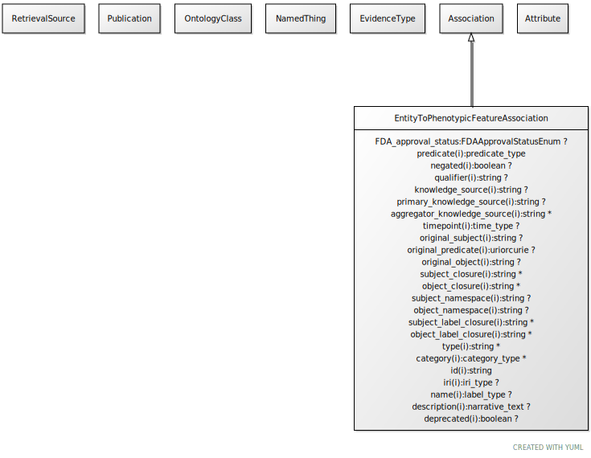

# Type: entity to phenotypic feature association

URI: [biolink:EntityToPhenotypicFeatureAssociation](https://w3id.org/biolink/vocab/EntityToPhenotypicFeatureAssociation)

## Parents

 *  is_a: [Association](Association.md) - A typed association between two entities, supported by evidence

## Uses Mixins

 *  mixin: [EntityToFeatureOrDiseaseQualifiers](EntityToFeatureOrDiseaseQualifiers.md) - Qualifiers for entity to disease or phenotype associations

## Mixin for

 * [CaseToPhenotypicFeatureAssociation](CaseToPhenotypicFeatureAssociation.md) (mixin)  - An association between a case (e.g. individual patient) and a phenotypic feature in which the individual has or has had the phenotype
 * [DiseaseToPhenotypicFeatureAssociation](DiseaseToPhenotypicFeatureAssociation.md) (mixin)  - An association between a disease and a phenotypic feature in which the phenotypic feature is associated with the disease in some way
 * [ExposureEventToPhenotypicFeatureAssociation](ExposureEventToPhenotypicFeatureAssociation.md) (mixin)  - Any association between an environment and a phenotypic feature, where being in the environment influences the phenotype
 * [GeneToPhenotypicFeatureAssociation](GeneToPhenotypicFeatureAssociation.md) (mixin) 
 * [GenotypeToPhenotypicFeatureAssociation](GenotypeToPhenotypicFeatureAssociation.md) (mixin)  - Any association between one genotype and a phenotypic feature, where having the genotype confers the phenotype, either in isolation or through environment
 * [VariantToPhenotypicFeatureAssociation](VariantToPhenotypicFeatureAssociation.md) (mixin) 

## Referenced by class

## Attributes

### Own

 * [entity to phenotypic feature association➞description](entity_to_phenotypic_feature_association_description.md)  OPT
    * Description: A description of specific aspects of this phenotype, not otherwise covered by the phenotype ontology class
    * range: [NarrativeText](types/NarrativeText.md)
 * [entity to phenotypic feature association➞object](entity_to_phenotypic_feature_association_object.md)  REQ
    * Description: phenotypic class
    * range: [PhenotypicFeature](PhenotypicFeature.md)
    * Example:    
    * Example:    
    * Example:    
 * [sex qualifier](sex_qualifier.md)  OPT
    * Description: a qualifier used in a phenotypic association to state whether the association is specific to a particular sex.
    * range: [BiologicalSex](BiologicalSex.md)

### Inherited from association:

 * [association type](association_type.md)  OPT
    * Description: connects an association to the type of association (e.g. gene to phenotype)
    * range: [OntologyClass](OntologyClass.md)
 * [association➞id](association_id.md)  REQ
    * Description: A unique identifier for an association
    * range: [String](types/String.md)
    * in subsets: (translator_minimal)
 * [negated](negated.md)  OPT
    * Description: if set to true, then the association is negated i.e. is not true
    * range: [Boolean](types/Boolean.md)
 * [provided by](provided_by.md)  0..*
    * Description: connects an association to the agent (person, organization or group) that provided it
    * range: [Provider](Provider.md)
 * [publications](publications.md)  0..*
    * Description: connects an association to publications supporting the association
    * range: [Publication](Publication.md)
 * [qualifiers](qualifiers.md)  0..*
    * Description: connects an association to qualifiers that modify or qualify the meaning of that association
    * range: [OntologyClass](OntologyClass.md)
 * [relation](relation.md)  REQ
    * Description: The relation which describes an association between a subject and an object in a more granular manner. Usually this is a term from Relation Ontology, but it can be any edge CURIE.
    * range: [Uriorcurie](types/Uriorcurie.md)
 * [subject](subject.md)  REQ
    * Description: connects an association to the subject of the association. For example, in a gene-to-phenotype association, the gene is subject and phenotype is object.
    * range: [NamedThing](NamedThing.md)

### Mixed in from frequency qualifier mixin:

 * [frequency qualifier](frequency_qualifier.md)  OPT
    * Description: a qualifier used in a phenotypic association to state how frequent the phenotype is observed in the subject
    * range: [FrequencyValue](FrequencyValue.md)

### Mixed in from entity to feature or disease qualifiers:

 * [onset qualifier](onset_qualifier.md)  OPT
    * Description: a qualifier used in a phenotypic association to state when the phenotype appears is in the subject
    * range: [Onset](Onset.md)

### Mixed in from entity to feature or disease qualifiers:

 * [severity qualifier](severity_qualifier.md)  OPT
    * Description: a qualifier used in a phenotypic association to state how severe the phenotype is in the subject
    * range: [SeverityValue](SeverityValue.md)
