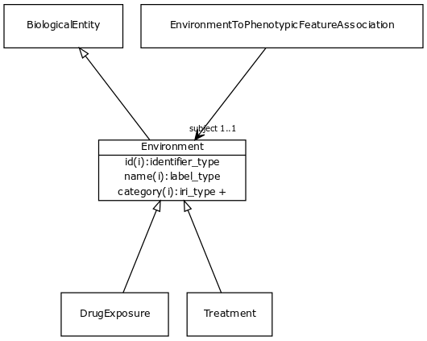

# Class: environment

A feature of the environment of an organism that influences one or more phenotypic features of that organism, potentially mediated by genes

URI: [http://bioentity.io/vocab/Environment](http://bioentity.io/vocab/Environment)

## Mappings

 * [SIO:000955](http://semanticscience.org/resource/SIO_000955)
## Inheritance

 *  is_a: [biological entity](BiologicalEntity.md)
## Children

 *  child: [treatment](Treatment.md) - A treatment is targeted at a disease or phenotype and may involve multiple drug 'exposures'
 *  child: [drug exposure](DrugExposure.md) - A drug exposure is an intake of a particular chemical substance
## Used in

 *  class: [environment](Environment.md) references: [treatment](Treatment.md)
 *  class: [environment](Environment.md) references: [drug exposure](DrugExposure.md)
## Fields

 * _[related to](related_to.md)_
    * _A grouping for any relationship type that holds between any two things_
    * range: [named thing](NamedThing.md)
    * inherited from: [named thing](NamedThing.md)
