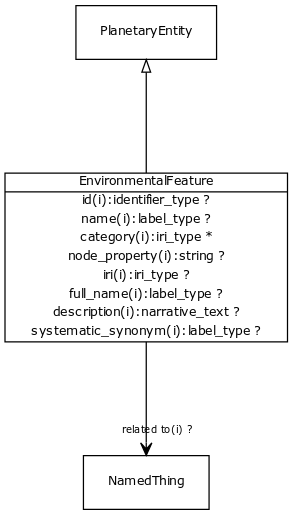

# Class: environmental feature

URI: [http://bioentity.io/vocab/EnvironmentalFeature](http://bioentity.io/vocab/EnvironmentalFeature)

## Mappings

 * [ENVO:00002297](http://purl.obolibrary.org/obo/ENVO_00002297)
## Inheritance

 *  is_a: [planetary entity](PlanetaryEntity.md) - Any entity or process that exists at the level of the whole planet
## Children

## Fields

 * _[related to](related_to.md)_
    * _A grouping for any relationship type that holds between any two things_
    * range: [named thing](NamedThing.md)
    * inherited from: [named thing](NamedThing.md)
