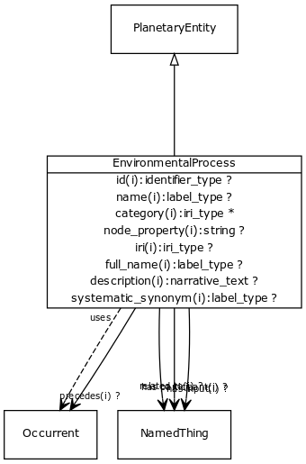

# Class: environmental process

URI: [http://bioentity.io/vocab/EnvironmentalProcess](http://bioentity.io/vocab/EnvironmentalProcess)

## Mappings

 * [ENVO:02500000](http://purl.obolibrary.org/obo/ENVO_02500000)
## Inheritance

 *  is_a: [planetary entity](PlanetaryEntity.md) - Any entity or process that exists at the level of the whole planet
 *  mixin: [occurrent](Occurrent.md) - A processual entity
## Children

## Fields

 * _[regulates, process to process](regulates_process_to_process.md)_
    * range: [occurrent](Occurrent.md)
    * __Local__
 * _[has participant](has_participant.md) *subsets: translator_minimal*_
    * _holds between a process and a continuant, where the continuant is somehow involved in the process _
    * range: string
    * __Local__
 * _[has input](has_input.md) *subsets: translator_minimal*_
    * _holds between a process and a continuant, where the continuant is an input into the process_
    * range: string
    * __Local__
 * _[precedes](precedes.md) *subsets: translator_minimal*_
    * _holds between two processes, where one completes before the other begins_
    * range: [occurrent](Occurrent.md)
    * __Local__
 * _[related to](related_to.md)_
    * _A grouping for any relationship type that holds between any two things_
    * range: [named thing](NamedThing.md)
    * inherited from: [named thing](NamedThing.md)
