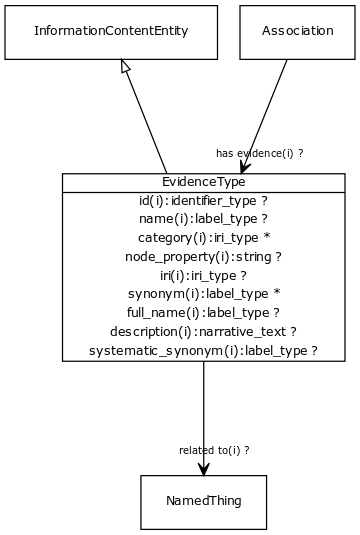

# Class: evidence type

Class of evidence that supports an association

URI: [http://bioentity.io/vocab/EvidenceType](http://bioentity.io/vocab/EvidenceType)

## Mappings

 * [ECO:0000000](http://purl.obolibrary.org/obo/ECO_0000000)
## Inheritance

 *  is_a: [information content entity](InformationContentEntity.md) - a piece of information that typically describes some piece of biology or is used as support.
## Children

## Fields

 * _[related to](related_to.md)_
    * _A grouping for any relationship type that holds between any two things_
    * range: [named thing](NamedThing.md)
    * inherited from: [named thing](NamedThing.md)
