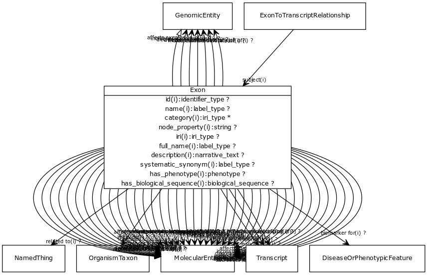

# Class: exon

A region of the transcript sequence within a gene which is not removed from the primary RNA transcript by RNA splicing

URI: [http://bioentity.io/vocab/Exon](http://bioentity.io/vocab/Exon)

## Mappings

 * [SO:0000147](http://purl.obolibrary.org/obo/SO_0000147)
 * [SIO:010445](http://semanticscience.org/resource/SIO_010445)
 * [WD:Q373027](http://purl.obolibrary.org/obo/WD_Q373027)
## Inheritance

 *  is_a: [genomic entity](GenomicEntity.md) - an entity that can either be directly located on a genome (gene, transcript, exon, regulatory region) or is encoded in a genome (protein)
## Children

## Used in

## Fields

 * _[related to](related_to.md)_
    * _A grouping for any relationship type that holds between any two things_
    * range: [named thing](NamedThing.md)
    * inherited from: [named thing](NamedThing.md)
 * _[molecularly interacts with](molecularly_interacts_with.md) *subsets: translator_minimal*_
    * range: [molecular entity](MolecularEntity.md)
    * inherited from: [molecular entity](MolecularEntity.md)
 * _[regulates, entity to entity](regulates_entity_to_entity.md) *subsets: translator_minimal*_
    * range: [molecular entity](MolecularEntity.md)
    * inherited from: [molecular entity](MolecularEntity.md)
 * _[biomarker for](biomarker_for.md) *subsets: translator_minimal*_
    * _holds between a measurable molecular entity and a disease or phenotypic feature, where the entity is used as an indicator of the presence or state of the disease or feature._
    * range: [disease or phenotypic feature](DiseaseOrPhenotypicFeature.md)
    * inherited from: [molecular entity](MolecularEntity.md)
 * _[in taxon](in_taxon.md) *subsets: translator_minimal*_
    * _connects a thing to a class representing a taxon_
    * range: [organism taxon](OrganismTaxon.md)
    * inherited from: [thing with taxon](ThingWithTaxon.md)
