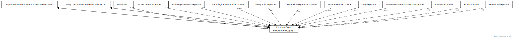

# Type: exposure event

A feature of the environment of an organism that influences one or more phenotypic features of that organism, potentially mediated by genes

URI: [biolink:ExposureEvent](https://w3id.org/biolink/vocab/ExposureEvent)

## Parents

 *  is_a: [BiologicalEntity](BiologicalEntity.md)

## Children

 * [ChemicalExposure](ChemicalExposure.md) - A chemical exposure is an intake of a particular chemical substance
 * [Treatment](Treatment.md) - A treatment is targeted at a disease or phenotype and may involve multiple drug 'exposures'

## Referenced by class

 *  **[DiseaseToExposureAssociation](DiseaseToExposureAssociation.md)** *[disease to exposure association➞object](disease_to_exposure_association_object.md)*  REQ  **[ExposureEvent](ExposureEvent.md)**
 *  **[ExposureEventToPhenotypicFeatureAssociation](ExposureEventToPhenotypicFeatureAssociation.md)** *[exposure event to phenotypic feature association➞subject](exposure_event_to_phenotypic_feature_association_subject.md)*  REQ  **[ExposureEvent](ExposureEvent.md)**

## Attributes

### Inherited from biological entity:

 * [category](category.md)  1..*
    * Description: Name of the high level ontology class in which this entity is categorized. Corresponds to the label for the biolink entity type class. In a neo4j database this MAY correspond to the neo4j label tag
    * range: [CategoryType](types/CategoryType.md)
    * in subsets: (translator_minimal)
 * [id](id.md)  REQ
    * Description: A unique identifier for a thing. Must be either a CURIE shorthand for a URI or a complete URI
    * range: [String](types/String.md)
    * in subsets: (translator_minimal)
 * [name](name.md)  REQ
    * Description: A human-readable name for a thing
    * range: [LabelType](types/LabelType.md)
    * in subsets: (translator_minimal)

## Other properties

|  |  |  |
| --- | --- | --- |
| **Aliases:** | | exposure |
|  | | experimental condition |
| **Mappings:** | | XCO:0000000 |

