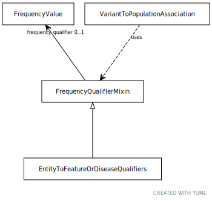

# Type: frequency qualifier mixin

Qualifier for frequency type associations

URI: [biolink:FrequencyQualifierMixin](https://w3id.org/biolink/vocab/FrequencyQualifierMixin)

## Children

 * [EntityToFeatureOrDiseaseQualifiers](EntityToFeatureOrDiseaseQualifiers.md) - Qualifiers for entity to disease or phenotype associations

## Mixin for

 * [VariantToPopulationAssociation](VariantToPopulationAssociation.md) (mixin)  - An association between a variant and a population, where the variant has particular frequency in the population

## Referenced by class

## Attributes

### Own

 * [frequency qualifier](frequency_qualifier.md)  OPT
    * Description: a qualifier used in a phenotypic association to state how frequent the phenotype is observed in the subject
    * range: [FrequencyValue](FrequencyValue.md)
