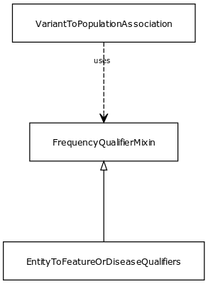

# Class: frequency qualifier mixin

Qualifier for freqency type associations

URI: [biolink:FrequencyQualifierMixin](https://w3id.org/biolink/vocab/FrequencyQualifierMixin)

## Children

 * [EntityToFeatureOrDiseaseQualifiers](EntityToFeatureOrDiseaseQualifiers.md) - Qualifiers for entity to disease or phenotype associations

## Mixin for

 * [VariantToPopulationAssociation](VariantToPopulationAssociation.md) (mixin)  - An association between a variant and a population, where the variant has particular frequency in the population

## Referenced by class

## Attributes

