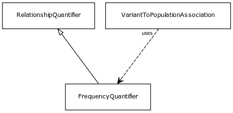

# Class: frequency quantifier

URI: [http://bioentity.io/vocab/FrequencyQuantifier](http://bioentity.io/vocab/FrequencyQuantifier)

## Mappings

## Inheritance

 *  is_a: [RelationshipQuantifier](RelationshipQuantifier.md)
## Children

 * [VariantToPopulationAssociation](VariantToPopulationAssociation.md) (mixin)  - An association between a variant and a population, where the variant has particular frequency in the population
## Used in

## Fields

 * [has count](has_count.md)
    * Description: number of things with a particular property
    * range: **integer**
    * __Local__
 * [has percentage](has_percentage.md)
    * Description: equivalent to has quotient multiplied by 100
    * range: **double**
    * __Local__
 * [has quotient](has_quotient.md)
    * Description: A grouping for any property that holds between a node and a value
    * range: **double**
    * __Local__
 * [has total](has_total.md)
    * Description: total number of things in a particular reference set
    * range: **integer**
    * __Local__
