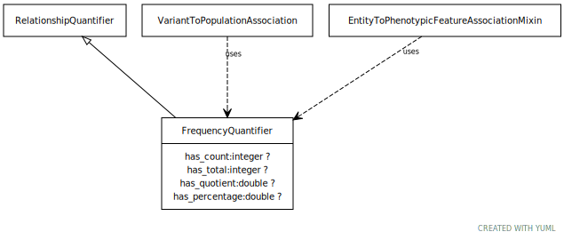

# Type: frequency quantifier

URI: [biolink:FrequencyQuantifier](https://w3id.org/biolink/vocab/FrequencyQuantifier)

## Parents

 *  is_a: [RelationshipQuantifier](RelationshipQuantifier.md)

## Mixin for

 * [VariantToPopulationAssociation](VariantToPopulationAssociation.md) (mixin)  - An association between a variant and a population, where the variant has particular frequency in the population

## Referenced by class

## Attributes

### Own

 * [has count](has_count.md)  OPT
    * Description: number of things with a particular property
    * range: [Integer](types/Integer.md)
 * [has percentage](has_percentage.md)  OPT
    * Description: equivalent to has quotient multiplied by 100
    * range: [Double](types/Double.md)
 * [has quotient](has_quotient.md)  OPT
    * range: [Double](types/Double.md)
 * [has total](has_total.md)  OPT
    * Description: total number of things in a particular reference set
    * range: [Integer](types/Integer.md)
