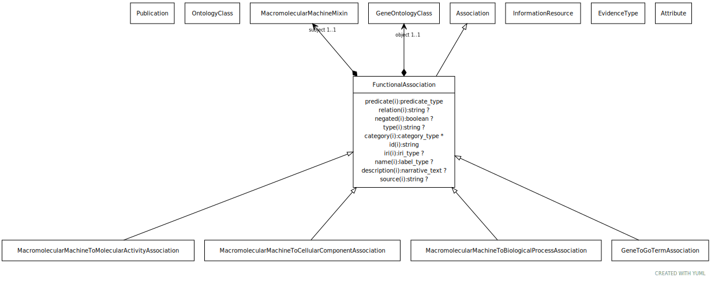

# Type: functional association

An association between a macromolecular machine (gene, gene product or complex of gene products) and either a molecular activity, a biological process or a cellular location in which a function is executed

URI: [biolink:FunctionalAssociation](https://w3id.org/biolink/vocab/FunctionalAssociation)

## Parents

 *  is_a: [Association](Association.md) - A typed association between two entities, supported by evidence

## Children

 * [GeneToGoTermAssociation](GeneToGoTermAssociation.md)
 * [MacromolecularMachineToBiologicalProcessAssociation](MacromolecularMachineToBiologicalProcessAssociation.md) - A functional association between a macromolecular machine (gene, gene product or complex) and a biological process or pathway (as represented in the GO biological process branch), where the entity carries out some part of the process, regulates it, or acts upstream of it
 * [MacromolecularMachineToCellularComponentAssociation](MacromolecularMachineToCellularComponentAssociation.md) - A functional association between a macromolecular machine (gene, gene product or complex) and a cellular component (as represented in the GO cellular component branch), where the entity carries out its function in the cellular component
 * [MacromolecularMachineToMolecularActivityAssociation](MacromolecularMachineToMolecularActivityAssociation.md) - A functional association between a macromolecular machine (gene, gene product or complex) and a molecular activity (as represented in the GO molecular function branch), where the entity carries out the activity, or contributes to its execution

## Referenced by class

## Attributes

### Own

 * [functional association➞object](functional_association_object.md)  REQ
    * Description: class describing the activity, process or localization of the gene product
    * range: [GeneOntologyClass](GeneOntologyClass.md)
    * Example:    
    * Example:    
 * [functional association➞subject](functional_association_subject.md)  REQ
    * Description: gene, product or macromolecular complex that has the function associated with the GO term
    * range: [MacromolecularMachine](MacromolecularMachine.md)
    * Example:    

### Inherited from association:

 * [association type](association_type.md)  OPT
    * Description: connects an association to the type of association (e.g. gene to phenotype)
    * range: [OntologyClass](OntologyClass.md)
 * [association➞id](association_id.md)  REQ
    * Description: A unique identifier for an association
    * range: [String](types/String.md)
    * in subsets: (translator_minimal)
 * [negated](negated.md)  OPT
    * Description: if set to true, then the association is negated i.e. is not true
    * range: [Boolean](types/Boolean.md)
 * [provided by](provided_by.md)  0..*
    * Description: connects an association to the agent (person, organization or group) that provided it
    * range: [Provider](Provider.md)
 * [publications](publications.md)  0..*
    * Description: connects an association to publications supporting the association
    * range: [Publication](Publication.md)
 * [qualifiers](qualifiers.md)  0..*
    * Description: connects an association to qualifiers that modify or qualify the meaning of that association
    * range: [OntologyClass](OntologyClass.md)
 * [relation](relation.md)  REQ
    * Description: The relation which describes an association between a subject and an object in a more granular manner. Usually this is a term from Relation Ontology, but it can be any edge CURIE.
    * range: [Uriorcurie](types/Uriorcurie.md)
