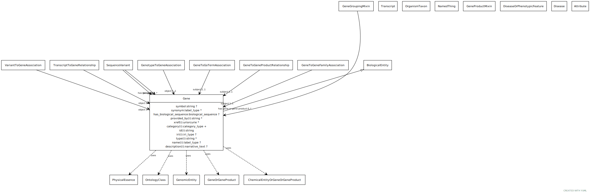

# Type: gene

URI: [biolink:Gene](https://w3id.org/biolink/vocab/Gene)

## Parents

 *  is_a: [GeneOrGeneProduct](GeneOrGeneProduct.md) - a union of genes or gene products. Frequently an identifier for one will be used as proxy for another

## Referenced by class

 *  **[DiseaseOrPhenotypicFeature](DiseaseOrPhenotypicFeature.md)** *[condition associated with gene](condition_associated_with_gene.md)*  0..*  **[Gene](Gene.md)**
 *  **[GeneToGeneProductRelationship](GeneToGeneProductRelationship.md)** *[gene to gene product relationship➞subject](gene_to_gene_product_relationship_subject.md)*  REQ  **[Gene](Gene.md)**
 *  **[Gene](Gene.md)** *[genetically interacts with](genetically_interacts_with.md)*  0..*  **[Gene](Gene.md)**
 *  **[GenotypeToGeneAssociation](GenotypeToGeneAssociation.md)** *[genotype to gene association➞object](genotype_to_gene_association_object.md)*  REQ  **[Gene](Gene.md)**
 *  **[NamedThing](NamedThing.md)** *[has gene](has_gene.md)*  OPT  **[Gene](Gene.md)**
 *  **[SequenceVariant](SequenceVariant.md)** *[is frameshift variant of](is_frameshift_variant_of.md)*  0..*  **[Gene](Gene.md)**
 *  **[SequenceVariant](SequenceVariant.md)** *[is missense variant of](is_missense_variant_of.md)*  0..*  **[Gene](Gene.md)**
 *  **[SequenceVariant](SequenceVariant.md)** *[is nearby variant of](is_nearby_variant_of.md)*  0..*  **[Gene](Gene.md)**
 *  **[SequenceVariant](SequenceVariant.md)** *[is non coding variant of](is_non_coding_variant_of.md)*  0..*  **[Gene](Gene.md)**
 *  **[SequenceVariant](SequenceVariant.md)** *[is nonsense variant of](is_nonsense_variant_of.md)*  0..*  **[Gene](Gene.md)**
 *  **[SequenceVariant](SequenceVariant.md)** *[is splice site variant of](is_splice_site_variant_of.md)*  0..*  **[Gene](Gene.md)**
 *  **[SequenceVariant](SequenceVariant.md)** *[is synonymous variant of](is_synonymous_variant_of.md)*  0..*  **[Gene](Gene.md)**
 *  **[SequenceVariant](SequenceVariant.md)** *[sequence variant➞has gene](sequence_variant_has_gene.md)*  0..*  **[Gene](Gene.md)**
 *  **[TranscriptToGeneRelationship](TranscriptToGeneRelationship.md)** *[transcript to gene relationship➞object](transcript_to_gene_relationship_object.md)*  REQ  **[Gene](Gene.md)**

## Attributes

### Inherited from gene or gene product:

 * [category](category.md)  1..*
    * Description: Name of the high level ontology class in which this entity is categorized. Corresponds to the label for the biolink entity type class. In a neo4j database this MAY correspond to the neo4j label tag
    * range: [CategoryType](types/CategoryType.md)
    * in subsets: (translator_minimal)
 * [has biological sequence](has_biological_sequence.md)  OPT
    * Description: connects a genomic feature to its sequence
    * range: [BiologicalSequence](types/BiologicalSequence.md)
 * [id](id.md)  REQ
    * Description: A unique identifier for a thing. Must be either a CURIE shorthand for a URI or a complete URI
    * range: [String](types/String.md)
    * in subsets: (translator_minimal)
 * [macromolecular machine➞name](macromolecular_machine_name.md)  REQ
    * Description: genes are typically designated by a short symbol and a full name. We map the symbol to the default display name and use an additional slot for full name
    * range: [SymbolType](types/SymbolType.md)

## Other properties

|  |  |  |
| --- | --- | --- |
| **Aliases:** | | locus |
| **Mappings:** | | SO:0000704 |
|  | | SIO:010035 |
|  | | WIKIDATA:Q7187 |

