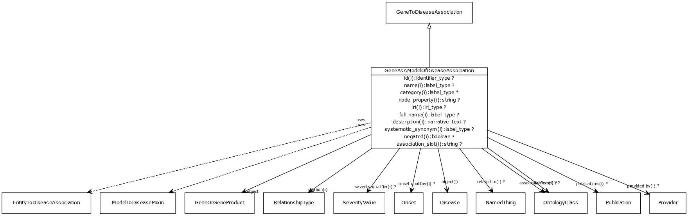

# Class: gene as a model of disease association

URI: [biolink:GeneAsAModelOfDiseaseAssociation](https://w3id.org/biolink/vocab/GeneAsAModelOfDiseaseAssociation)

## Parents

 *  is_a: [GeneToDiseaseAssociation](GeneToDiseaseAssociation.md)

## Uses Mixins

 *  mixin: [ModelToDiseaseMixin](ModelToDiseaseMixin.md) - This mixin is used for any association class for which the subject (source node) plays the role of a 'model', in that it recapitulates some features of the disease in a way that is useful for studying the disease outside a patient carrying the disease
 *  mixin: [EntityToDiseaseAssociation](EntityToDiseaseAssociation.md) - mixin class for any association whose object (target node) is a disease

## Referenced by class

## Attributes

### Own

 * [subject](gene_as_a_model_of_disease_association_subject.md)  REQ
    * range: [GeneOrGeneProduct](GeneOrGeneProduct.md)

### Inherited from association:

 * [id](association_id.md)  REQ
    * Description: A unique identifier for an association
    * range: [IdentifierType](IdentifierType.md)
    * inherited from: [Association](Association.md)
    * in subsets: (translator_minimal)
 * [subject](subject.md)  REQ
    * Description: connects an association to the subject of the association. For example, in a gene-to-phenotype association, the gene is subject and phenotype is object.
    * range: [IriType](IriType.md)
    * inherited from: [Association](Association.md)
 * [relation](relation.md)  REQ
    * Description: the relationship type by which a subject is connected to an object in an association
    * range: [IriType](IriType.md)
    * inherited from: [Association](Association.md)
 * [object](object.md)  REQ
    * Description: connects an association to the object of the association. For example, in a gene-to-phenotype association, the gene is subject and phenotype is object.
    * range: [IriType](IriType.md)
    * inherited from: [Association](Association.md)
 * [negated](negated.md)  OPT
    * Description: if set to true, then the association is negated i.e. is not true
    * range: [Boolean](Boolean.md)
    * inherited from: [Association](Association.md)
 * [association type](association_type.md)  OPT
    * Description: connects an association to the type of association (e.g. gene to phenotype)
    * range: [OntologyClass](OntologyClass.md)
    * inherited from: [Association](Association.md)
 * [qualifiers](qualifiers.md)  0..*
    * Description: connects an association to qualifiers that modify or qualify the meaning of that association
    * range: [OntologyClass](OntologyClass.md)
    * inherited from: [Association](Association.md)
 * [publications](publications.md)  0..*
    * Description: connects an association to publications supporting the association
    * range: [Publication](Publication.md)
    * inherited from: [Association](Association.md)
 * [provided by](provided_by.md)  OPT
    * Description: connects an association to the agent (person, organization or group) that provided it
    * range: [Provider](Provider.md)
    * inherited from: [Association](Association.md)

### Inherited from entity to feature or disease qualifiers:

 * [severity qualifier](severity_qualifier.md)  OPT
    * Description: a qualifier used in a phenotypic association to state how severe the phenotype is in the subject
    * range: [SeverityValue](SeverityValue.md)
    * inherited from: [EntityToFeatureOrDiseaseQualifiers](EntityToFeatureOrDiseaseQualifiers.md)
 * [onset qualifier](onset_qualifier.md)  OPT
    * Description: a qualifier used in a phenotypic association to state when the phenotype appears is in the subject
    * range: [Onset](Onset.md)
    * inherited from: [EntityToFeatureOrDiseaseQualifiers](EntityToFeatureOrDiseaseQualifiers.md)

### Inherited from frequency qualifier mixin:

 * [frequency qualifier](frequency_qualifier.md)  OPT
    * Description: a qualifier used in a phenotypic association to state how frequent the phenotype is observed in the subject
    * range: [FrequencyValue](FrequencyValue.md)
    * inherited from: [FrequencyQualifierMixin](FrequencyQualifierMixin.md)

### Domain for slot:

 * [subject](gene_as_a_model_of_disease_association_subject.md)  REQ
    * range: [GeneOrGeneProduct](GeneOrGeneProduct.md)
