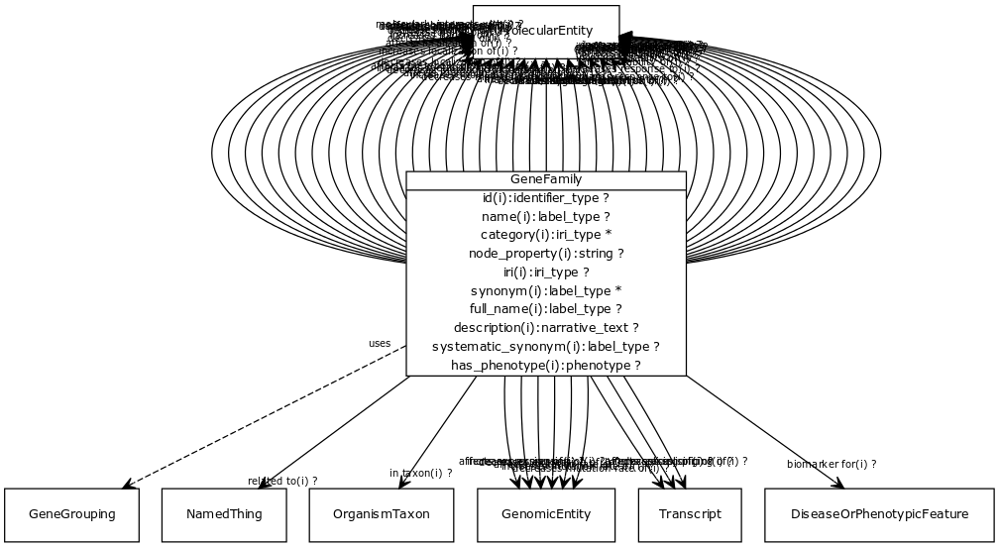

# Class: gene family

any grouping of multiple genes or gene products related by common descent

URI: [http://bioentity.io/vocab/GeneFamily](http://bioentity.io/vocab/GeneFamily)

## Mappings

 * [SIO:001380](http://semanticscience.org/resource/SIO_001380)
 * [NCIT:C20130](http://purl.obolibrary.org/obo/NCIT_C20130)
 * [WD:Q417841](http://purl.obolibrary.org/obo/WD_Q417841)
## Inheritance

 *  is_a: [molecular entity](MolecularEntity.md) - A gene, gene product, small molecule or macromolecule (including protein complex)
 *  mixin: [gene grouping](GeneGrouping.md) - any grouping of multiple genes or gene products
## Children

## Fields

 * _[related to](related_to.md)_
    * _A grouping for any relationship type that holds between any two things_
    * range: [named thing](NamedThing.md)
    * inherited from: [named thing](NamedThing.md)
 * _[molecularly interacts with](molecularly_interacts_with.md) *subsets: translator_minimal*_
    * range: [molecular entity](MolecularEntity.md)
    * inherited from: [molecular entity](MolecularEntity.md)
 * _[regulates, entity to entity](regulates_entity_to_entity.md) *subsets: translator_minimal*_
    * range: [molecular entity](MolecularEntity.md)
    * inherited from: [molecular entity](MolecularEntity.md)
 * _[biomarker for](biomarker_for.md) *subsets: translator_minimal*_
    * _holds between a measurable molecular entity and a disease or phenotypic feature, where the entity is used as an indicator of the presence or state of the disease or feature._
    * range: [disease or phenotypic feature](DiseaseOrPhenotypicFeature.md)
    * inherited from: [molecular entity](MolecularEntity.md)
 * _[in taxon](in_taxon.md) *subsets: translator_minimal*_
    * _connects a thing to a class representing a taxon_
    * range: [organism taxon](OrganismTaxon.md)
    * inherited from: [thing with taxon](ThingWithTaxon.md)
