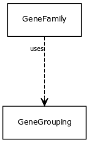

# Class: gene grouping

any grouping of multiple genes or gene products

URI: [http://bioentity.io/vocab/GeneGrouping](http://bioentity.io/vocab/GeneGrouping)

## Mappings

## Inheritance

## Children

 *  mixin: [gene family](GeneFamily.md) - any grouping of multiple genes or gene products related by common descent
## Used in

 *  class: [gene grouping](GeneGrouping.md) references: [gene family](GeneFamily.md)
## Fields

