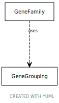

# Type: gene grouping

any grouping of multiple genes or gene products

URI: [biolink:GeneGrouping](https://w3id.org/biolink/vocab/GeneGrouping)

## Mixin for

 * [GeneFamily](GeneFamily.md) (mixin)  - any grouping of multiple genes or gene products related by common descent

## Referenced by class

## Attributes

