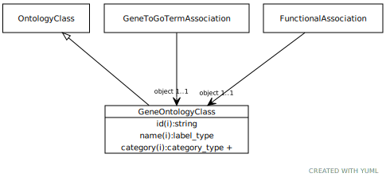

# Type: gene ontology class

an ontology class that describes a functional aspect of a gene, gene prodoct or complex

URI: [biolink:GeneOntologyClass](https://w3id.org/biolink/vocab/GeneOntologyClass)

## Parents

 *  is_a: [OntologyClass](OntologyClass.md) - a concept or class in an ontology, vocabulary or thesaurus

## Referenced by class

 *  **[FunctionalAssociation](FunctionalAssociation.md)** *[functional association➞object](functional_association_object.md)*  REQ  **[GeneOntologyClass](GeneOntologyClass.md)**
 *  **[GeneToGoTermAssociation](GeneToGoTermAssociation.md)** *[gene to go term association➞object](gene_to_go_term_association_object.md)*  REQ  **[GeneOntologyClass](GeneOntologyClass.md)**

## Attributes

### Inherited from ontology class:

 * [category](category.md)  1..*
    * Description: Name of the high level ontology class in which this entity is categorized. Corresponds to the label for the biolink entity type class. In a neo4j database this MAY correspond to the neo4j label tag
    * range: [CategoryType](types/CategoryType.md)
    * in subsets: (translator_minimal)
 * [id](id.md)  REQ
    * Description: A unique identifier for a thing. Must be either a CURIE shorthand for a URI or a complete URI
    * range: [String](types/String.md)
    * in subsets: (translator_minimal)
 * [name](name.md)  REQ
    * Description: A human-readable name for a thing
    * range: [LabelType](types/LabelType.md)
    * in subsets: (translator_minimal)

## Other properties

|  |  |  |
| --- | --- | --- |
| **In Subsets:** | | testing |

