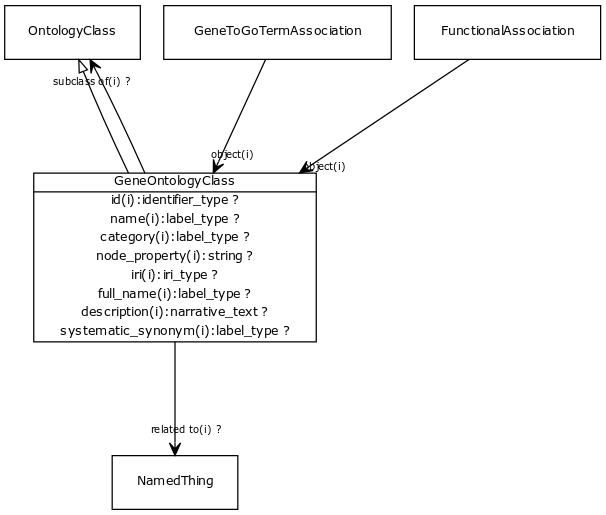

# Class: gene ontology class

an ontology class that describes a functional aspect of a gene, gene prodoct or complex

URI: [http://bioentity.io/vocab/GeneOntologyClass](http://bioentity.io/vocab/GeneOntologyClass)

## Mappings

## Inheritance

 *  is_a: [OntologyClass](OntologyClass.md) - a concept or class in an ontology, vocabulary or thesaurus
## Children

## Used in

 *  class: **[FunctionalAssociation](FunctionalAssociation.md)** *[object](object.md)* **[GeneOntologyClass](GeneOntologyClass.md)**
 *  class: **[GeneToGoTermAssociation](GeneToGoTermAssociation.md)** *[object](object.md)* **[GeneOntologyClass](GeneOntologyClass.md)**
## Fields

 * _[subclass of](subclass_of.md) *subsets*: (translator_minimal)_
    * _holds between two classes where the domain class is a specialization of the range class_
    * range: [OntologyClass](OntologyClass.md)
    * inherited from: [OntologyClass](OntologyClass.md)
