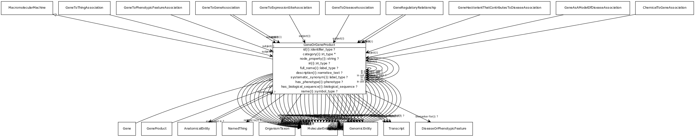

# Class: gene or gene product

a union of genes or gene products. Frequently an identifier for one will be used as proxy for another

URI: [biolink:GeneOrGeneProduct](https://w3id.org/biolink/vocab/GeneOrGeneProduct)

## Parents

 *  is_a: [MacromolecularMachine](MacromolecularMachine.md) - A union of gene, gene product, and macromolecular complex. These are the basic units of function in a cell. They either carry out individual biological activities, or they encode molecules which do this.

## Children

 * [Gene](Gene.md)
 * [GeneProduct](GeneProduct.md) - The functional molecular product of a single gene. Gene products are either proteins or functional RNA molecules

## Referenced by class

 *  **[ChemicalToGeneAssociation](ChemicalToGeneAssociation.md)** *[object](chemical_to_gene_association_object.md)*  REQ  **[GeneOrGeneProduct](GeneOrGeneProduct.md)**
 *  **[AnatomicalEntity](AnatomicalEntity.md)** *[expresses](expresses.md)*  0..*  **[GeneOrGeneProduct](GeneOrGeneProduct.md)**
 *  **[GeneAsAModelOfDiseaseAssociation](GeneAsAModelOfDiseaseAssociation.md)** *[subject](gene_as_a_model_of_disease_association_subject.md)*  REQ  **[GeneOrGeneProduct](GeneOrGeneProduct.md)**
 *  **[GeneHasVariantThatContributesToDiseaseAssociation](GeneHasVariantThatContributesToDiseaseAssociation.md)** *[subject](gene_has_variant_that_contributes_to_disease_association_subject.md)*  REQ  **[GeneOrGeneProduct](GeneOrGeneProduct.md)**
 *  **[GeneRegulatoryRelationship](GeneRegulatoryRelationship.md)** *[object](gene_regulatory_relationship_object.md)*  REQ  **[GeneOrGeneProduct](GeneOrGeneProduct.md)**
 *  **[GeneRegulatoryRelationship](GeneRegulatoryRelationship.md)** *[subject](gene_regulatory_relationship_subject.md)*  REQ  **[GeneOrGeneProduct](GeneOrGeneProduct.md)**
 *  **[GeneToDiseaseAssociation](GeneToDiseaseAssociation.md)** *[subject](gene_to_disease_association_subject.md)*  REQ  **[GeneOrGeneProduct](GeneOrGeneProduct.md)**
 *  **[GeneToExpressionSiteAssociation](GeneToExpressionSiteAssociation.md)** *[subject](gene_to_expression_site_association_subject.md)*  REQ  **[GeneOrGeneProduct](GeneOrGeneProduct.md)**
 *  **[GeneToGeneAssociation](GeneToGeneAssociation.md)** *[object](gene_to_gene_association_object.md)*  REQ  **[GeneOrGeneProduct](GeneOrGeneProduct.md)**
 *  **[GeneToGeneAssociation](GeneToGeneAssociation.md)** *[subject](gene_to_gene_association_subject.md)*  REQ  **[GeneOrGeneProduct](GeneOrGeneProduct.md)**
 *  **[GeneToPhenotypicFeatureAssociation](GeneToPhenotypicFeatureAssociation.md)** *[subject](gene_to_phenotypic_feature_association_subject.md)*  REQ  **[GeneOrGeneProduct](GeneOrGeneProduct.md)**
 *  **[GeneToThingAssociation](GeneToThingAssociation.md)** *[subject](gene_to_thing_association_subject.md)*  REQ  **[GeneOrGeneProduct](GeneOrGeneProduct.md)**
 *  **[GeneOrGeneProduct](GeneOrGeneProduct.md)** *[in cell population with](in_cell_population_with.md)*  0..*  **[GeneOrGeneProduct](GeneOrGeneProduct.md)**
 *  **[GeneOrGeneProduct](GeneOrGeneProduct.md)** *[in complex with](in_complex_with.md)*  0..*  **[GeneOrGeneProduct](GeneOrGeneProduct.md)**
 *  **[GeneOrGeneProduct](GeneOrGeneProduct.md)** *[in pathway with](in_pathway_with.md)*  0..*  **[GeneOrGeneProduct](GeneOrGeneProduct.md)**

## Attributes

### Inherited from macromolecular machine:

 * [name](macromolecular_machine_name.md)  REQ
    * range: [SymbolType](SymbolType.md)
    * inherited from: [MacromolecularMachine](MacromolecularMachine.md)

### Inherited from named thing:

 * [id](id.md)  REQ
    * Description: A unique identifier for a thing. Must be either a CURIE shorthand for a URI or a complete URI
    * range: [IdentifierType](IdentifierType.md)
    * inherited from: [NamedThing](NamedThing.md)
    * in subsets: (translator_minimal)
 * [name](name.md)  REQ
    * Description: A human-readable name for a thing
    * range: [LabelType](LabelType.md)
    * inherited from: [NamedThing](NamedThing.md)
    * in subsets: (translator_minimal)
 * [category](category.md)  1..*
    * Description: Name of the high level ontology class in which this entity is categorized. Corresponds to the label for the biolink entity type class. In a neo4j database this MAY correspond to the neo4j label tag
    * range: [IriType](IriType.md)
    * inherited from: [NamedThing](NamedThing.md)
    * in subsets: (translator_minimal)

### Inherited from thing with taxon:

 * [in taxon](in_taxon.md)  0..*
    * Description: connects a thing to a class representing a taxon
    * range: [OrganismTaxon](OrganismTaxon.md)
    * inherited from: [ThingWithTaxon](ThingWithTaxon.md)
    * in subsets: (translator_minimal)

### Domain for slot:

 * [expressed in](expressed_in.md)  0..*
    * Description: holds between a gene or gene product and an anatomical entity in which it is expressed
    * range: [AnatomicalEntity](AnatomicalEntity.md)
    * in subsets: (translator_minimal)
 * [in cell population with](in_cell_population_with.md)  0..*
    * Description: holds between two genes or gene products that are expressed in the same cell type or population
    * range: [GeneOrGeneProduct](GeneOrGeneProduct.md)
    * in subsets: (translator_minimal)
 * [in complex with](in_complex_with.md)  0..*
    * Description: holds between two genes or gene products that are part of (or code for products that are part of) in the same macromolecular complex
    * range: [GeneOrGeneProduct](GeneOrGeneProduct.md)
    * in subsets: (translator_minimal)
 * [in pathway with](in_pathway_with.md)  0..*
    * Description: holds between two genes or gene products that are part of in the same biological pathway
    * range: [GeneOrGeneProduct](GeneOrGeneProduct.md)
    * in subsets: (translator_minimal)
