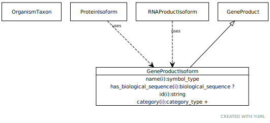

# Type: gene product isoform

This is an abstract class that can be mixed in with different kinds of gene products to indicate that the gene product is intended to represent a specific isoform rather than a canonical or reference or generic product. The designation of canonical or reference may be arbitrary, or it may represent the superclass of all isoforms.

URI: [biolink:GeneProductIsoform](https://w3id.org/biolink/vocab/GeneProductIsoform)

## Parents

 *  is_a: [GeneProduct](GeneProduct.md) - The functional molecular product of a single gene. Gene products are either proteins or functional RNA molecules

## Mixin for

 * [RNAProductIsoform](RNAProductIsoform.md) (mixin)  - Represents a protein that is a specific isoform of the canonical or reference RNA
 * [ProteinIsoform](ProteinIsoform.md) (mixin)  - Represents a protein that is a specific isoform of the canonical or reference protein. See https://www.ncbi.nlm.nih.gov/pmc/articles/PMC4114032/

## Referenced by class

## Attributes

### Inherited from gene product:

 * [category](category.md)  1..*
    * Description: Name of the high level ontology class in which this entity is categorized. Corresponds to the label for the biolink entity type class. In a neo4j database this MAY correspond to the neo4j label tag
    * range: [CategoryType](types/CategoryType.md)
    * in subsets: (translator_minimal)
 * [has biological sequence](has_biological_sequence.md)  OPT
    * Description: connects a genomic feature to its sequence
    * range: [BiologicalSequence](types/BiologicalSequence.md)
 * [id](id.md)  REQ
    * Description: A unique identifier for a thing. Must be either a CURIE shorthand for a URI or a complete URI
    * range: [String](types/String.md)
    * in subsets: (translator_minimal)
 * [macromolecular machine➞name](macromolecular_machine_name.md)  REQ
    * Description: genes are typically designated by a short symbol and a full name. We map the symbol to the default display name and use an additional slot for full name
    * range: [SymbolType](types/SymbolType.md)
