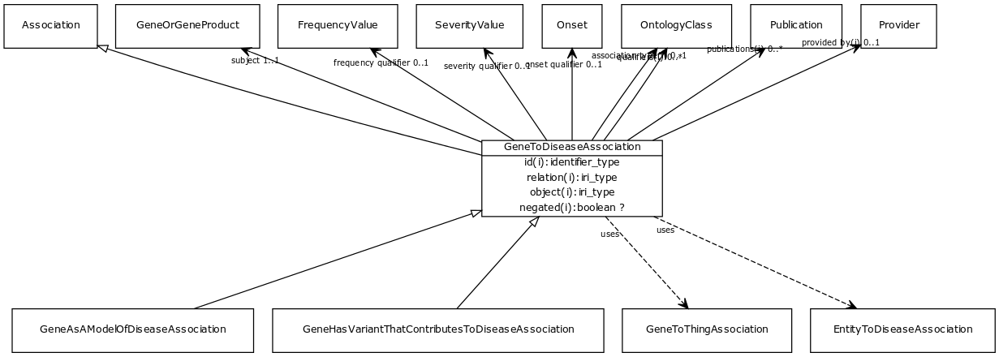

# Class: gene to disease association

URI: [http://w3id.org/biolink/vocab/GeneToDiseaseAssociation](http://w3id.org/biolink/vocab/GeneToDiseaseAssociation)

## Mappings

 * [SIO:000983](http://semanticscience.org/resource/SIO_000983)
## Inheritance

 *  is_a: [Association](Association.md) - A typed association between two entities, supported by evidence
 *  mixin: [EntityToDiseaseAssociation](EntityToDiseaseAssociation.md) - mixin class for any association whose object (target node) is a disease
 *  mixin: [GeneToThingAssociation](GeneToThingAssociation.md)
## Children

 * [GeneAsAModelOfDiseaseAssociation](GeneAsAModelOfDiseaseAssociation.md)
 * [GeneHasVariantThatContributesToDiseaseAssociation](GeneHasVariantThatContributesToDiseaseAssociation.md)
## Used in

## Fields

 * [gene to disease association.subject](gene_to_disease_association_subject.md)
    * Description: gene in which variation is correlated with the disease - may be protective or causative or associative, or as a model
    * range: [GeneOrGeneProduct](GeneOrGeneProduct.md) [required]
    * __Local__
 * [association slot](association_slot.md)
    * Description: any slot that relates an association to another entity
    * range: **string**
    * inherited from: [Association](Association.md)
 * [association type](association_type.md)
    * Description: connects an association to the type of association (e.g. gene to phenotype)
    * range: [OntologyClass](OntologyClass.md)
    * inherited from: [Association](Association.md)
 * [association.id](association_id.md) *subsets*: (translator_minimal)
    * Description: A unique identifier for an association
    * range: [IdentifierType](IdentifierType.md)
    * inherited from: [Association](Association.md)
 * [negated](negated.md)
    * Description: if set to true, then the association is negated i.e. is not true
    * range: **boolean**
    * inherited from: [Association](Association.md)
 * [object](object.md)
    * Description: connects an association to the object of the association. For example, in a gene-to-phenotype association, the gene is subject and phenotype is object.
    * range: **string** [required]
    * inherited from: [Association](Association.md)
 * [onset qualifier](onset_qualifier.md)
    * Description: a qualifier used in a phenotypic association to state when the phenotype appears is in the subject
    * range: [Onset](Onset.md)
    * inherited from: [EntityToFeatureOrDiseaseQualifiers](EntityToFeatureOrDiseaseQualifiers.md)
 * [provided by](provided_by.md)
    * Description: connects an association to the agent (person, organization or group) that provided it
    * range: [Provider](Provider.md)
    * inherited from: [Association](Association.md)
 * [publications](publications.md)
    * Description: connects an association to publications supporting the association
    * range: [Publication](Publication.md)*
    * inherited from: [Association](Association.md)
 * [qualifiers](qualifiers.md)
    * Description: connects an association to qualifiers that modify or qualify the meaning of that association
    * range: [OntologyClass](OntologyClass.md)*
    * inherited from: [Association](Association.md)
 * [relation](relation.md)
    * Description: the relationship type by which a subject is connected to an object in an association
    * range: [RelationshipType](RelationshipType.md) [required]
    * inherited from: [Association](Association.md)
 * [severity qualifier](severity_qualifier.md)
    * Description: a qualifier used in a phenotypic association to state how severe the phenotype is in the subject
    * range: [SeverityValue](SeverityValue.md)
    * inherited from: [EntityToFeatureOrDiseaseQualifiers](EntityToFeatureOrDiseaseQualifiers.md)
