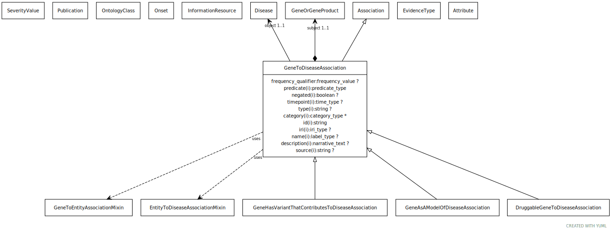

# Type: gene to disease association

URI: [biolink:GeneToDiseaseAssociation](https://w3id.org/biolink/vocab/GeneToDiseaseAssociation)

## Parents

 *  is_a: [Association](Association.md) - A typed association between two entities, supported by evidence

## Uses Mixins

 *  mixin: [EntityToDiseaseAssociation](EntityToDiseaseAssociation.md) - mixin class for any association whose object (target node) is a disease
 *  mixin: [GeneToThingAssociation](GeneToThingAssociation.md)

## Children

 * [GeneAsAModelOfDiseaseAssociation](GeneAsAModelOfDiseaseAssociation.md)
 * [GeneHasVariantThatContributesToDiseaseAssociation](GeneHasVariantThatContributesToDiseaseAssociation.md)

## Referenced by class

## Attributes

### Own

 * [gene to disease association➞subject](gene_to_disease_association_subject.md)  REQ
    * Description: gene in which variation is correlated with the disease - may be protective or causative or associative, or as a model
    * range: [GeneOrGeneProduct](GeneOrGeneProduct.md)

### Inherited from association:

 * [association type](association_type.md)  OPT
    * Description: connects an association to the type of association (e.g. gene to phenotype)
    * range: [OntologyClass](OntologyClass.md)
 * [association➞id](association_id.md)  REQ
    * Description: A unique identifier for an association
    * range: [String](types/String.md)
    * in subsets: (translator_minimal)
 * [negated](negated.md)  OPT
    * Description: if set to true, then the association is negated i.e. is not true
    * range: [Boolean](types/Boolean.md)
 * [object](object.md)  REQ
    * Description: connects an association to the object of the association. For example, in a gene-to-phenotype association, the gene is subject and phenotype is object.
    * range: [NamedThing](NamedThing.md)
 * [provided by](provided_by.md)  0..*
    * Description: connects an association to the agent (person, organization or group) that provided it
    * range: [Provider](Provider.md)
 * [publications](publications.md)  0..*
    * Description: connects an association to publications supporting the association
    * range: [Publication](Publication.md)
 * [qualifiers](qualifiers.md)  0..*
    * Description: connects an association to qualifiers that modify or qualify the meaning of that association
    * range: [OntologyClass](OntologyClass.md)
 * [relation](relation.md)  REQ
    * Description: The relation which describes an association between a subject and an object in a more granular manner. Usually this is a term from Relation Ontology, but it can be any edge CURIE.
    * range: [Uriorcurie](types/Uriorcurie.md)

### Mixed in from frequency qualifier mixin:

 * [frequency qualifier](frequency_qualifier.md)  OPT
    * Description: a qualifier used in a phenotypic association to state how frequent the phenotype is observed in the subject
    * range: [FrequencyValue](FrequencyValue.md)

### Mixed in from entity to feature or disease qualifiers:

 * [onset qualifier](onset_qualifier.md)  OPT
    * Description: a qualifier used in a phenotypic association to state when the phenotype appears is in the subject
    * range: [Onset](Onset.md)

### Mixed in from entity to feature or disease qualifiers:

 * [severity qualifier](severity_qualifier.md)  OPT
    * Description: a qualifier used in a phenotypic association to state how severe the phenotype is in the subject
    * range: [SeverityValue](SeverityValue.md)

## Other properties

|  |  |  |
| --- | --- | --- |
| **Mappings:** | | SIO:000983 |
| **Comments:** | | NCIT:R176 refers to the inverse relationship |

