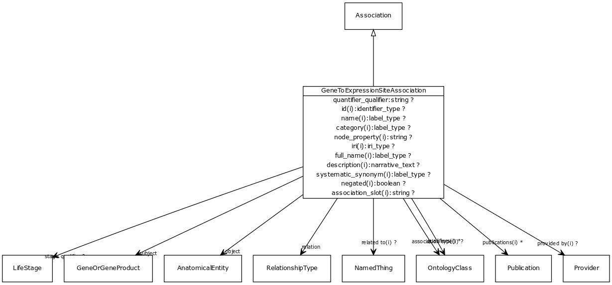

# Class: gene to expression site association

An association between a gene and an expression site, possibly qualified by stage/timing info.

URI: [biolink:GeneToExpressionSiteAssociation](https://w3id.org/biolink/vocab/GeneToExpressionSiteAssociation)

## Parents

 *  is_a: [Association](Association.md) - A typed association between two entities, supported by evidence

## Referenced by class

## Attributes

### Own

 * [object](gene_to_expression_site_association_object.md)  REQ
    * range: [AnatomicalEntity](AnatomicalEntity.md)
 * [quantifier qualifier](gene_to_expression_site_association_quantifier_qualifier.md)  OPT
    * range: [OntologyClass](OntologyClass.md)
 * [relation](gene_to_expression_site_association_relation.md)  REQ
    * range: [Uriorcurie](Uriorcurie.md)
 * [stage qualifier](gene_to_expression_site_association_stage_qualifier.md)  OPT
    * range: [LifeStage](LifeStage.md)
 * [subject](gene_to_expression_site_association_subject.md)  REQ
    * range: [GeneOrGeneProduct](GeneOrGeneProduct.md)

### Inherited from association:

 * [subject](subject.md)  REQ
    * Description: connects an association to the subject of the association. For example, in a gene-to-phenotype association, the gene is subject and phenotype is object.
    * range: [NamedThing](NamedThing.md)
    * inherited from: [Association](Association.md)
 * [relation](relation.md)  REQ
    * Description: the relationship type by which a subject is connected to an object in an association
    * range: [Uriorcurie](Uriorcurie.md)
    * inherited from: [Association](Association.md)
 * [object](object.md)  REQ
    * Description: connects an association to the object of the association. For example, in a gene-to-phenotype association, the gene is subject and phenotype is object.
    * range: [NamedThing](NamedThing.md)
    * inherited from: [Association](Association.md)
 * [id](association_id.md)  REQ
    * Description: A unique identifier for an association
    * range: [Nodeidentifier](Nodeidentifier.md)
    * inherited from: [Association](Association.md)
    * in subsets: (translator_minimal)
 * [negated](negated.md)  OPT
    * Description: if set to true, then the association is negated i.e. is not true
    * range: [Boolean](Boolean.md)
    * inherited from: [Association](Association.md)
 * [association type](association_type.md)  OPT
    * Description: connects an association to the type of association (e.g. gene to phenotype)
    * range: [OntologyClass](OntologyClass.md)
    * inherited from: [Association](Association.md)
 * [qualifiers](qualifiers.md)  0..*
    * Description: connects an association to qualifiers that modify or qualify the meaning of that association
    * range: [OntologyClass](OntologyClass.md)
    * inherited from: [Association](Association.md)
 * [publications](publications.md)  0..*
    * Description: connects an association to publications supporting the association
    * range: [Publication](Publication.md)
    * inherited from: [Association](Association.md)
 * [provided by](provided_by.md)  OPT
    * Description: connects an association to the agent (person, organization or group) that provided it
    * range: [Provider](Provider.md)
    * inherited from: [Association](Association.md)

### Domain for slot:

 * [object](gene_to_expression_site_association_object.md)  REQ
    * range: [AnatomicalEntity](AnatomicalEntity.md)
 * [quantifier qualifier](gene_to_expression_site_association_quantifier_qualifier.md)  OPT
    * range: [OntologyClass](OntologyClass.md)
 * [relation](gene_to_expression_site_association_relation.md)  REQ
    * range: [Uriorcurie](Uriorcurie.md)
 * [stage qualifier](gene_to_expression_site_association_stage_qualifier.md)  OPT
    * range: [LifeStage](LifeStage.md)
 * [subject](gene_to_expression_site_association_subject.md)  REQ
    * range: [GeneOrGeneProduct](GeneOrGeneProduct.md)
 * [quantifier qualifier](quantifier_qualifier.md)  OPT
    * Description: A measurable quantity for the object of the association
    * range: [OntologyClass](OntologyClass.md)
    * inherited from: [GeneToExpressionSiteAssociation](GeneToExpressionSiteAssociation.md)
 * [stage qualifier](stage_qualifier.md)  OPT
    * Description: stage at which expression takes place
    * range: [LifeStage](LifeStage.md)
    * inherited from: [GeneToExpressionSiteAssociation](GeneToExpressionSiteAssociation.md)
