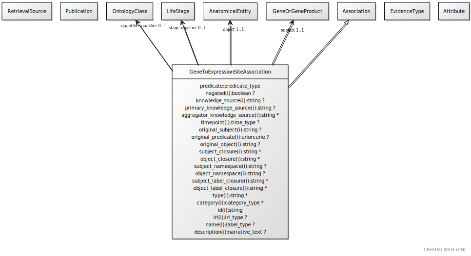

# Type: gene to expression site association

An association between a gene and an expression site, possibly qualified by stage/timing info.

URI: [biolink:GeneToExpressionSiteAssociation](https://w3id.org/biolink/vocab/GeneToExpressionSiteAssociation)

## Parents

 *  is_a: [Association](Association.md) - A typed association between two entities, supported by evidence

## Referenced by class

## Attributes

### Own

 * [gene to expression site association➞object](gene_to_expression_site_association_object.md)  REQ
    * Description: location in which the gene is expressed
    * range: [AnatomicalEntity](AnatomicalEntity.md)
    * Example:    
 * [gene to expression site association➞quantifier qualifier](gene_to_expression_site_association_quantifier_qualifier.md)  OPT
    * Description: can be used to indicate magnitude, or also ranking
    * range: [OntologyClass](OntologyClass.md)
 * [gene to expression site association➞relation](gene_to_expression_site_association_relation.md)  REQ
    * Description: expression relationship
    * range: [Uriorcurie](types/Uriorcurie.md)
 * [gene to expression site association➞stage qualifier](gene_to_expression_site_association_stage_qualifier.md)  OPT
    * Description: stage at which the gene is expressed in the site
    * range: [LifeStage](LifeStage.md)
    * Example:    
 * [gene to expression site association➞subject](gene_to_expression_site_association_subject.md)  REQ
    * Description: gene in which variation is correlated with the phenotypic feature
    * range: [GeneOrGeneProduct](GeneOrGeneProduct.md)

### Inherited from association:

 * [association type](association_type.md)  OPT
    * Description: connects an association to the type of association (e.g. gene to phenotype)
    * range: [OntologyClass](OntologyClass.md)
 * [association➞id](association_id.md)  REQ
    * Description: A unique identifier for an association
    * range: [String](types/String.md)
    * in subsets: (translator_minimal)
 * [negated](negated.md)  OPT
    * Description: if set to true, then the association is negated i.e. is not true
    * range: [Boolean](types/Boolean.md)
 * [provided by](provided_by.md)  0..*
    * Description: connects an association to the agent (person, organization or group) that provided it
    * range: [Provider](Provider.md)
 * [publications](publications.md)  0..*
    * Description: connects an association to publications supporting the association
    * range: [Publication](Publication.md)
 * [qualifiers](qualifiers.md)  0..*
    * Description: connects an association to qualifiers that modify or qualify the meaning of that association
    * range: [OntologyClass](OntologyClass.md)

## Other properties

|  |  |  |
| --- | --- | --- |
| **See also:** | | https://github.com/monarch-initiative/ingest-artifacts/tree/master/sources/BGee |

