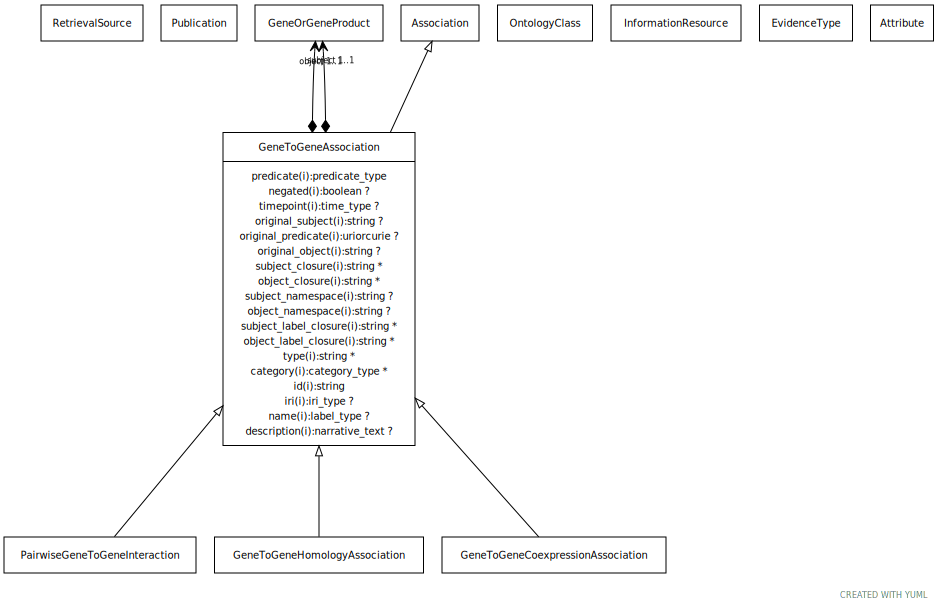

# Type: gene to gene association

abstract parent class for different kinds of gene-gene or gene product to gene product relationships. Includes homology and interaction.

URI: [biolink:GeneToGeneAssociation](https://w3id.org/biolink/vocab/GeneToGeneAssociation)

## Parents

 *  is_a: [Association](Association.md) - A typed association between two entities, supported by evidence

## Children

 * [GeneToGeneHomologyAssociation](GeneToGeneHomologyAssociation.md) - A homology association between two genes. May be orthology (in which case the species of subject and object should differ) or paralogy (in which case the species may be the same)
 * [PairwiseGeneToGeneInteraction](PairwiseGeneToGeneInteraction.md) - An interaction between two genes or two gene products. May be physical (e.g. protein binding) or genetic (between genes). May be symmetric (e.g. protein interaction) or directed (e.g. phosphorylation)

## Referenced by class

## Attributes

### Own

 * [gene to gene association➞object](gene_to_gene_association_object.md)  REQ
    * Description: the object gene in the association. If the relation is symmetric, subject vs object is arbitrary. We allow a gene product to stand as proxy for the gene or vice versa
    * range: [GeneOrGeneProduct](GeneOrGeneProduct.md)
 * [gene to gene association➞subject](gene_to_gene_association_subject.md)  REQ
    * Description: the subject gene in the association. If the relation is symmetric, subject vs object is arbitrary. We allow a gene product to stand as proxy for the gene or vice versa
    * range: [GeneOrGeneProduct](GeneOrGeneProduct.md)

### Inherited from association:

 * [association type](association_type.md)  OPT
    * Description: connects an association to the type of association (e.g. gene to phenotype)
    * range: [OntologyClass](OntologyClass.md)
 * [association➞id](association_id.md)  REQ
    * Description: A unique identifier for an association
    * range: [String](types/String.md)
    * in subsets: (translator_minimal)
 * [negated](negated.md)  OPT
    * Description: if set to true, then the association is negated i.e. is not true
    * range: [Boolean](types/Boolean.md)
 * [provided by](provided_by.md)  0..*
    * Description: connects an association to the agent (person, organization or group) that provided it
    * range: [Provider](Provider.md)
 * [publications](publications.md)  0..*
    * Description: connects an association to publications supporting the association
    * range: [Publication](Publication.md)
 * [qualifiers](qualifiers.md)  0..*
    * Description: connects an association to qualifiers that modify or qualify the meaning of that association
    * range: [OntologyClass](OntologyClass.md)
 * [relation](relation.md)  REQ
    * Description: The relation which describes an association between a subject and an object in a more granular manner. Usually this is a term from Relation Ontology, but it can be any edge CURIE.
    * range: [Uriorcurie](types/Uriorcurie.md)

## Other properties

|  |  |  |
| --- | --- | --- |
| **Aliases:** | | molecular or genetic interaction |

