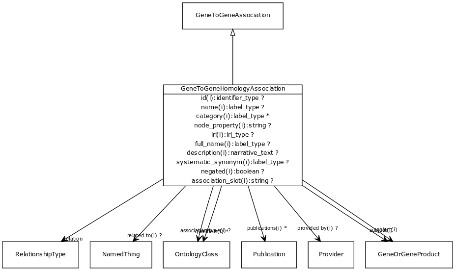

# Class: gene to gene homology association

A homology association between two genes. May be orthology (in which case the species of subject and object should differ) or paralogy (in which case the species may be the same)

URI: [biolink:GeneToGeneHomologyAssociation](https://w3id.org/biolink/vocab/GeneToGeneHomologyAssociation)

## Parents

 *  is_a: [GeneToGeneAssociation](GeneToGeneAssociation.md) - abstract parent class for different kinds of gene-gene or gene product to gene product relationships. Includes homology and interaction.

## Referenced by class

## Attributes

### Own

 * [relation](gene_to_gene_homology_association_relation.md)  REQ
    * range: [IriType](IriType.md)

### Inherited from association:

 * [id](association_id.md)  REQ
    * Description: A unique identifier for an association
    * range: [IdentifierType](IdentifierType.md)
    * inherited from: [Association](Association.md)
    * in subsets: (translator_minimal)
 * [subject](subject.md)  REQ
    * Description: connects an association to the subject of the association. For example, in a gene-to-phenotype association, the gene is subject and phenotype is object.
    * range: [IriType](IriType.md)
    * inherited from: [Association](Association.md)
 * [relation](relation.md)  REQ
    * Description: the relationship type by which a subject is connected to an object in an association
    * range: [IriType](IriType.md)
    * inherited from: [Association](Association.md)
 * [object](object.md)  REQ
    * Description: connects an association to the object of the association. For example, in a gene-to-phenotype association, the gene is subject and phenotype is object.
    * range: [IriType](IriType.md)
    * inherited from: [Association](Association.md)
 * [negated](negated.md)  OPT
    * Description: if set to true, then the association is negated i.e. is not true
    * range: [Boolean](Boolean.md)
    * inherited from: [Association](Association.md)
 * [association type](association_type.md)  OPT
    * Description: connects an association to the type of association (e.g. gene to phenotype)
    * range: [OntologyClass](OntologyClass.md)
    * inherited from: [Association](Association.md)
 * [qualifiers](qualifiers.md)  0..*
    * Description: connects an association to qualifiers that modify or qualify the meaning of that association
    * range: [OntologyClass](OntologyClass.md)
    * inherited from: [Association](Association.md)
 * [publications](publications.md)  0..*
    * Description: connects an association to publications supporting the association
    * range: [Publication](Publication.md)
    * inherited from: [Association](Association.md)
 * [provided by](provided_by.md)  OPT
    * Description: connects an association to the agent (person, organization or group) that provided it
    * range: [Provider](Provider.md)
    * inherited from: [Association](Association.md)

### Inherited from gene to gene association:

 * [subject](gene_to_gene_association_subject.md)  REQ
    * range: [GeneOrGeneProduct](GeneOrGeneProduct.md)
    * inherited from: [GeneToGeneAssociation](GeneToGeneAssociation.md)
 * [object](gene_to_gene_association_object.md)  REQ
    * range: [GeneOrGeneProduct](GeneOrGeneProduct.md)
    * inherited from: [GeneToGeneAssociation](GeneToGeneAssociation.md)

### Domain for slot:

 * [relation](gene_to_gene_homology_association_relation.md)  REQ
    * range: [IriType](IriType.md)
