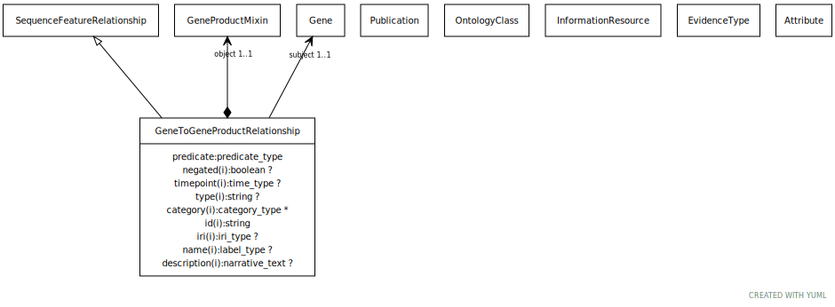

# Type: gene to gene product relationship

A gene is transcribed and potentially translated to a gene product

URI: [biolink:GeneToGeneProductRelationship](https://w3id.org/biolink/vocab/GeneToGeneProductRelationship)

## Parents

 *  is_a: [SequenceFeatureRelationship](SequenceFeatureRelationship.md) - For example, a particular exon is part of a particular transcript or gene

## Referenced by class

## Attributes

### Own

 * [gene to gene product relationship➞object](gene_to_gene_product_relationship_object.md)  REQ
    * range: [GeneProduct](GeneProduct.md)
 * [gene to gene product relationship➞relation](gene_to_gene_product_relationship_relation.md)  REQ
    * range: [Uriorcurie](types/Uriorcurie.md)
 * [gene to gene product relationship➞subject](gene_to_gene_product_relationship_subject.md)  REQ
    * range: [Gene](Gene.md)

### Inherited from sequence feature relationship:

 * [association type](association_type.md)  OPT
    * Description: connects an association to the type of association (e.g. gene to phenotype)
    * range: [OntologyClass](OntologyClass.md)
 * [association➞id](association_id.md)  REQ
    * Description: A unique identifier for an association
    * range: [String](types/String.md)
    * in subsets: (translator_minimal)
 * [negated](negated.md)  OPT
    * Description: if set to true, then the association is negated i.e. is not true
    * range: [Boolean](types/Boolean.md)
 * [provided by](provided_by.md)  0..*
    * Description: connects an association to the agent (person, organization or group) that provided it
    * range: [Provider](Provider.md)
 * [publications](publications.md)  0..*
    * Description: connects an association to publications supporting the association
    * range: [Publication](Publication.md)
 * [qualifiers](qualifiers.md)  0..*
    * Description: connects an association to qualifiers that modify or qualify the meaning of that association
    * range: [OntologyClass](OntologyClass.md)
