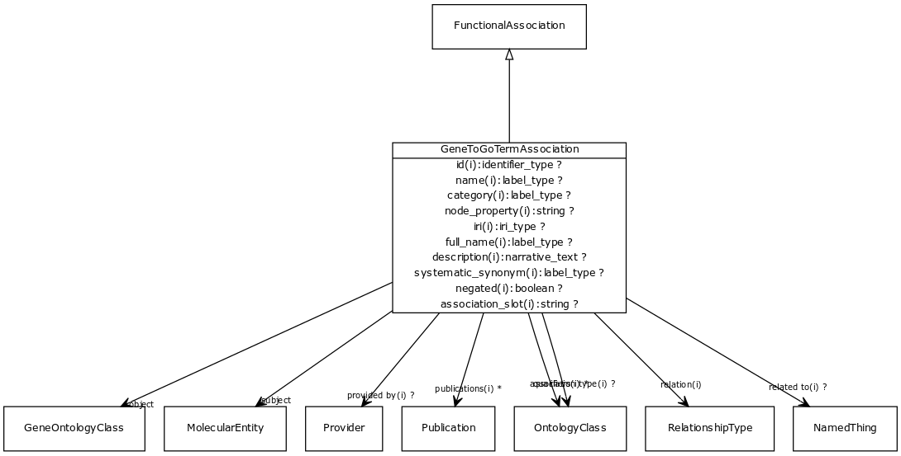

# Class: gene to go term association

URI: [http://w3id.org/biolink/vocab/GeneToGoTermAssociation](http://w3id.org/biolink/vocab/GeneToGoTermAssociation)

## Mappings

 * [http://bio2rdf.org/wormbase_vocabulary:Gene-GO-Association](http://purl.obolibrary.org/obo/http_//bio2rdf.org/wormbase_vocabulary_Gene-GO-Association)
## Inheritance

 *  is_a: [FunctionalAssociation](FunctionalAssociation.md) - An association between a macromolecular machine (gene, gene product or complex of gene products) and either a molecular activity, a biological process or a cellular location in which a function is executed
## Children

## Used in

## Fields

 * [gene to go term association.object](gene_to_go_term_association_object.md)
    * Description: class describing the activity, process or localization of the gene product
    * range: [GeneOntologyClass](GeneOntologyClass.md) [required]
    * __Local__
 * [gene to go term association.subject](gene_to_go_term_association_subject.md)
    * Description: gene, product or macromolecular complex that has the function associated with the GO term
    * range: [MolecularEntity](MolecularEntity.md) [required]
    * __Local__
 * [association slot](association_slot.md)
    * Description: any slot that relates an association to another entity
    * range: **string**
    * inherited from: [Association](Association.md)
 * [association type](association_type.md)
    * Description: connects an association to the type of association (e.g. gene to phenotype)
    * range: [OntologyClass](OntologyClass.md)
    * inherited from: [Association](Association.md)
 * [association.id](association_id.md) *subsets*: (translator_minimal)
    * Description: A unique identifier for an association
    * range: [IdentifierType](IdentifierType.md)
    * inherited from: [Association](Association.md)
 * [negated](negated.md)
    * Description: if set to true, then the association is negated i.e. is not true
    * range: **boolean**
    * inherited from: [Association](Association.md)
 * [provided by](provided_by.md)
    * Description: connects an association to the agent (person, organization or group) that provided it
    * range: [Provider](Provider.md)
    * inherited from: [Association](Association.md)
 * [publications](publications.md)
    * Description: connects an association to publications supporting the association
    * range: [Publication](Publication.md)*
    * inherited from: [Association](Association.md)
 * [qualifiers](qualifiers.md)
    * Description: connects an association to qualifiers that modify or qualify the meaning of that association
    * range: [OntologyClass](OntologyClass.md)*
    * inherited from: [Association](Association.md)
 * [relation](relation.md)
    * Description: the relationship type by which a subject is connected to an object in an association
    * range: [RelationshipType](RelationshipType.md) [required]
    * inherited from: [Association](Association.md)
