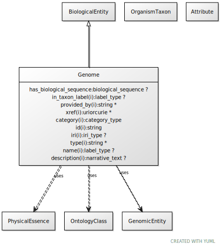

# Type: genome

A genome is the sum of genetic material within a cell or virion.

URI: [biolink:Genome](https://w3id.org/biolink/vocab/Genome)

## Parents

 *  is_a: [GenomicEntity](GenomicEntity.md) - an entity that can either be directly located on a genome (gene, transcript, exon, regulatory region) or is encoded in a genome (protein)

## Attributes

### Inherited from genomic entity:

 * [category](category.md)  1..*
    * Description: Name of the high level ontology class in which this entity is categorized. Corresponds to the label for the biolink entity type class. In a neo4j database this MAY correspond to the neo4j label tag
    * range: [CategoryType](types/CategoryType.md)
    * in subsets: (translator_minimal)
 * [has biological sequence](has_biological_sequence.md)  OPT
    * Description: connects a genomic feature to its sequence
    * range: [BiologicalSequence](types/BiologicalSequence.md)
 * [id](id.md)  REQ
    * Description: A unique identifier for a thing. Must be either a CURIE shorthand for a URI or a complete URI
    * range: [String](types/String.md)
    * in subsets: (translator_minimal)
 * [name](name.md)  REQ
    * Description: A human-readable name for a thing
    * range: [LabelType](types/LabelType.md)
    * in subsets: (translator_minimal)

## Other properties

|  |  |  |
| --- | --- | --- |
| **Mappings:** | | SO:0001026 |
|  | | SIO:000984 |
|  | | WIKIDATA:Q7020 |

