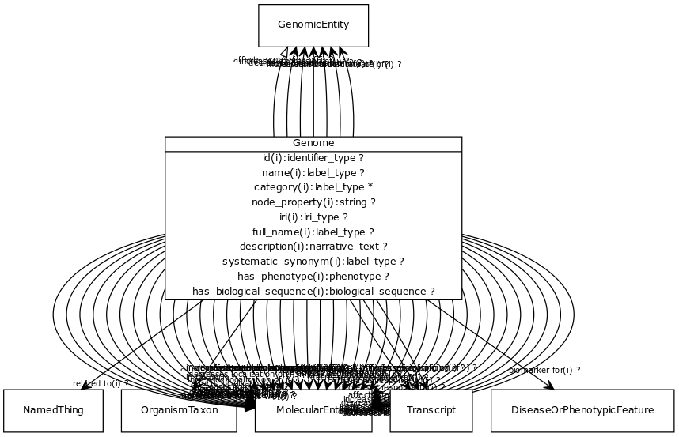

# Class: genome

A genome is the sum of genetic material within a cell or virion.

URI: [http://w3id.org/biolink/vocab/Genome](http://w3id.org/biolink/vocab/Genome)

## Mappings

 * [SO:0001026](http://purl.obolibrary.org/obo/SO_0001026)
 * [SIO:000984](http://semanticscience.org/resource/SIO_000984)
 * [WD:Q7020](http://purl.obolibrary.org/obo/WD_Q7020)
## Inheritance

 *  is_a: [GenomicEntity](GenomicEntity.md) - an entity that can either be directly located on a genome (gene, transcript, exon, regulatory region) or is encoded in a genome (protein)
## Children

## Fields

 * [affects abundance of](affects_abundance_of.md) *subsets*: (translator_minimal)
    * Description: holds between two molecular entities where the action or effect of one changes the amount of the other within a system of interest
    * range: [MolecularEntity](MolecularEntity.md)
    * inherited from: [MolecularEntity](MolecularEntity.md)
 * [affects activity of](affects_activity_of.md) *subsets*: (translator_minimal)
    * Description: holds between two molecular entities where the action or effect of one changes the activity of the other within a system of interest
    * range: [MolecularEntity](MolecularEntity.md)
    * inherited from: [MolecularEntity](MolecularEntity.md)
 * [affects degradation of](affects_degradation_of.md) *subsets*: (translator_minimal)
    * Description: holds between two molecular entities where the action or effect of one impacts the rate of degradation of the other within a system of interest
    * range: [MolecularEntity](MolecularEntity.md)
    * inherited from: [MolecularEntity](MolecularEntity.md)
 * [affects expression of](affects_expression_of.md) *subsets*: (translator_minimal)
    * Description: holds between two molecular entities where the action or effect of one changes the level of expression of the other within a system of interest
    * range: [GenomicEntity](GenomicEntity.md)
    * inherited from: [MolecularEntity](MolecularEntity.md)
 * [affects folding of](affects_folding_of.md) *subsets*: (translator_minimal)
    * Description: holds between two molecular entities where the action or effect of one changes the rate or quality of folding of the other 
    * range: [MolecularEntity](MolecularEntity.md)
    * inherited from: [MolecularEntity](MolecularEntity.md)
 * [affects localization of](affects_localization_of.md) *subsets*: (translator_minimal)
    * Description: holds between two molecular entities where the action or effect of one changes the localization of the other within a system of interest
    * range: [MolecularEntity](MolecularEntity.md)
    * inherited from: [MolecularEntity](MolecularEntity.md)
 * [affects metabolic processing of](affects_metabolic_processing_of.md) *subsets*: (translator_minimal)
    * Description: holds between two molecular entities where the action or effect of one impacts the metabolic processing of the other within a system of interest
    * range: [MolecularEntity](MolecularEntity.md)
    * inherited from: [MolecularEntity](MolecularEntity.md)
 * [affects molecular modification of](affects_molecular_modification_of.md) *subsets*: (translator_minimal)
    * Description: holds between two molecular entities where the action or effect of one leads changes in the molecular modification(s) of the other (e.g. via post-translational modifications of proteins such as the addition of phosphoryl group, or via redox reaction that adds or subtracts electrons)
    * range: [MolecularEntity](MolecularEntity.md)
    * inherited from: [MolecularEntity](MolecularEntity.md)
 * [affects mutation rate of](affects_mutation_rate_of.md) *subsets*: (translator_minimal)
    * Description: holds between a molecular entity and a genomic entity where the action or effect of the molecular entity impacts the rate of mutation of the genomic entity within a system of interest
    * range: [GenomicEntity](GenomicEntity.md)
    * inherited from: [MolecularEntity](MolecularEntity.md)
 * [affects response to](affects_response_to.md) *subsets*: (translator_minimal)
    * Description: holds between two molecular entities where the action or effect of one impacts the susceptibility of a biological entity or system (e.g. an organism, cell, cellular component, macromolecular machine, biological or pathological process) to the other
    * range: [MolecularEntity](MolecularEntity.md)
    * inherited from: [MolecularEntity](MolecularEntity.md)
 * [affects secretion of](affects_secretion_of.md) *subsets*: (translator_minimal)
    * Description: holds between two molecular entities where the action or effect of one impacts the rate of secretion of the other out of a cell, gland, or organ
    * range: [MolecularEntity](MolecularEntity.md)
    * inherited from: [MolecularEntity](MolecularEntity.md)
 * [affects splicing of](affects_splicing_of.md) *subsets*: (translator_minimal)
    * Description: holds between a molecular entity and an mRNA where the action or effect of the molecular entity impacts the splicing of the mRNA
    * range: [Transcript](Transcript.md)
    * inherited from: [MolecularEntity](MolecularEntity.md)
 * [affects stability of](affects_stability_of.md) *subsets*: (translator_minimal)
    * Description: holds between two molecular entities where the action or effect of one impacts the stability of the other within a system of interest
    * range: [MolecularEntity](MolecularEntity.md)
    * inherited from: [MolecularEntity](MolecularEntity.md)
 * [affects synthesis of](affects_synthesis_of.md) *subsets*: (translator_minimal)
    * Description: holds between two molecular entities where the action or effect of one impacts the rate of chemical synthesis of the other
    * range: [MolecularEntity](MolecularEntity.md)
    * inherited from: [MolecularEntity](MolecularEntity.md)
 * [affects transport of](affects_transport_of.md) *subsets*: (translator_minimal)
    * Description: holds between two molecular entities where the action or effect of one impacts the rate of transport of the other across some boundary in a system of interest
    * range: [MolecularEntity](MolecularEntity.md)
    * inherited from: [MolecularEntity](MolecularEntity.md)
 * [affects uptake of](affects_uptake_of.md) *subsets*: (translator_minimal)
    * Description: holds between two molecular entities where the action or effect of one impacts the rate of uptake of the other into of a cell, gland, or organ
    * range: [MolecularEntity](MolecularEntity.md)
    * inherited from: [MolecularEntity](MolecularEntity.md)
 * [biomarker for](biomarker_for.md) *subsets*: (translator_minimal)
    * Description: holds between a measurable molecular entity and a disease or phenotypic feature, where the entity is used as an indicator of the presence or state of the disease or feature.
    * range: [DiseaseOrPhenotypicFeature](DiseaseOrPhenotypicFeature.md)
    * inherited from: [MolecularEntity](MolecularEntity.md)
 * [category](category.md) *subsets*: (translator_minimal)
    * Description: Name of the high level ontology class in which this entity is categorized. Corresponds to the label for the biolink entity type class. In a neo4j database this MAY correspond to the neo4j label tag
    * range: [IriType](IriType.md)*
    * inherited from: [NamedThing](NamedThing.md)
 * [decreases abundance of](decreases_abundance_of.md) *subsets*: (translator_minimal)
    * Description: holds between two molecular entities where the action or effect of one decreases the amount of the other within a system of interest
    * range: [MolecularEntity](MolecularEntity.md)
    * inherited from: [MolecularEntity](MolecularEntity.md)
 * [decreases activity of](decreases_activity_of.md) *subsets*: (translator_minimal)
    * Description: holds between two molecular entities where the action or effect of one decreases the activity of the other within a system of interest
    * range: [MolecularEntity](MolecularEntity.md)
    * inherited from: [MolecularEntity](MolecularEntity.md)
 * [decreases degradation of](decreases_degradation_of.md) *subsets*: (translator_minimal)
    * Description: holds between two molecular entities where the action or effect of one decreases the rate of degradation of the other within a system of interest
    * range: [MolecularEntity](MolecularEntity.md)
    * inherited from: [MolecularEntity](MolecularEntity.md)
 * [decreases expression of](decreases_expression_of.md) *subsets*: (translator_minimal)
    * Description: holds between two molecular entities where the action or effect of one decreases the level of expression of the other within a system of interest
    * range: [GenomicEntity](GenomicEntity.md)
    * inherited from: [MolecularEntity](MolecularEntity.md)
 * [decreases folding of](decreases_folding_of.md) *subsets*: (translator_minimal)
    * Description: holds between two molecular entities where the action or effect of one decreases the rate or quality of folding of the other 
    * range: [MolecularEntity](MolecularEntity.md)
    * inherited from: [MolecularEntity](MolecularEntity.md)
 * [decreases localization of](decreases_localization_of.md) *subsets*: (translator_minimal)
    * Description: holds between two molecular entities where the action or effect of one decreases the proper localization of the other within a system of interest
    * range: [MolecularEntity](MolecularEntity.md)
    * inherited from: [MolecularEntity](MolecularEntity.md)
 * [decreases metabolic processing of](decreases_metabolic_processing_of.md) *subsets*: (translator_minimal)
    * Description: holds between two molecular entities where the action or effect of one decreases the rate of metabolic processing of the other within a system of interest
    * range: [MolecularEntity](MolecularEntity.md)
    * inherited from: [MolecularEntity](MolecularEntity.md)
 * [decreases molecular modification of](decreases_molecular_modification_of.md) *subsets*: (translator_minimal)
    * Description: holds between two molecular entities where the action or effect of one leads to decreased molecular modification(s) of the other (e.g. via post-translational modifications of proteins such as the addition of phosphoryl group, or via redox reaction that adds or subtracts electrons)
    * range: [MolecularEntity](MolecularEntity.md)
    * inherited from: [MolecularEntity](MolecularEntity.md)
 * [decreases mutation rate of](decreases_mutation_rate_of.md) *subsets*: (translator_minimal)
    * Description: holds between a molecular entity and a genomic entity where the action or effect of the molecular entity decreases the rate of mutation of the genomic entity within a system of interest
    * range: [GenomicEntity](GenomicEntity.md)
    * inherited from: [MolecularEntity](MolecularEntity.md)
 * [decreases response to](decreases_response_to.md) *subsets*: (translator_minimal)
    * Description: holds between two molecular entities where the action or effect of one decreases the susceptibility of a biological entity or system (e.g. an organism, cell, cellular component, macromolecular machine, biological or pathological process) to the other
    * range: [MolecularEntity](MolecularEntity.md)
    * inherited from: [MolecularEntity](MolecularEntity.md)
 * [decreases secretion of](decreases_secretion_of.md) *subsets*: (translator_minimal)
    * Description: holds between two molecular entities where the action or effect of one decreases the rate of secretion of the other out of a cell, gland, or organ
    * range: [MolecularEntity](MolecularEntity.md)
    * inherited from: [MolecularEntity](MolecularEntity.md)
 * [decreases splicing of](decreases_splicing_of.md) *subsets*: (translator_minimal)
    * Description: holds between a molecular entity and an mRNA where the action or effect of the molecular entity decreases the proper splicing of the mRNA
    * range: [Transcript](Transcript.md)
    * inherited from: [MolecularEntity](MolecularEntity.md)
 * [decreases stability of](decreases_stability_of.md) *subsets*: (translator_minimal)
    * Description: holds between two molecular entities where the action or effect of one decreases the stability of the other within a system of interest
    * range: [MolecularEntity](MolecularEntity.md)
    * inherited from: [MolecularEntity](MolecularEntity.md)
 * [decreases synthesis of](decreases_synthesis_of.md) *subsets*: (translator_minimal)
    * Description: holds between two molecular entities where the action or effect of one decreases the rate of chemical synthesis of the other
    * range: [MolecularEntity](MolecularEntity.md)
    * inherited from: [MolecularEntity](MolecularEntity.md)
 * [decreases transport of](decreases_transport_of.md) *subsets*: (translator_minimal)
    * Description: holds between two molecular entities where the action or effect of one decreases the rate of transport of the other across some boundary in a system of interest
    * range: [MolecularEntity](MolecularEntity.md)
    * inherited from: [MolecularEntity](MolecularEntity.md)
 * [decreases uptake of](decreases_uptake_of.md) *subsets*: (translator_minimal)
    * Description: holds between two molecular entities where the action or effect of one decreases the rate of uptake of the other into of a cell, gland, or organ
    * range: [MolecularEntity](MolecularEntity.md)
    * inherited from: [MolecularEntity](MolecularEntity.md)
 * [description](description.md) *subsets*: (translator_minimal)
    * Description: a human-readable description of a thing
    * range: [NarrativeText](NarrativeText.md)
    * inherited from: [NamedThing](NamedThing.md)
 * [full name](full_name.md)
    * Description: a long-form human readable name for a thing
    * range: [LabelType](LabelType.md)
    * inherited from: [NamedThing](NamedThing.md)
 * [has biological sequence](has_biological_sequence.md)
    * Description: connects a genomic feature to its sequence
    * range: [BiologicalSequence](BiologicalSequence.md)
    * inherited from: [GenomicEntity](GenomicEntity.md)
 * [has phenotype](has_phenotype.md) *subsets*: (translator_minimal)
    * Description: holds between a biological entity and a phenotype, where a phenotype is construed broadly as any kind of quality of an organism part, a collection of these qualities, or a change in quality or qualities (e.g. abnormally increased temperature). 
    * range: [Phenotype](Phenotype.md)
    * inherited from: [BiologicalEntity](BiologicalEntity.md)
 * [id](id.md) *subsets*: (translator_minimal)
    * Description: A unique identifier for a thing. Must be either a CURIE shorthand for a URI or a complete URI
    * range: [IdentifierType](IdentifierType.md)
    * inherited from: [NamedThing](NamedThing.md)
 * [in taxon](in_taxon.md) *subsets*: (translator_minimal)
    * Description: connects a thing to a class representing a taxon
    * range: [OrganismTaxon](OrganismTaxon.md)
    * inherited from: [ThingWithTaxon](ThingWithTaxon.md)
 * [increases abundance of](increases_abundance_of.md) *subsets*: (translator_minimal)
    * Description: holds between two molecular entities where the action or effect of one increases the amount of the other within a system of interest
    * range: [MolecularEntity](MolecularEntity.md)
    * inherited from: [MolecularEntity](MolecularEntity.md)
 * [increases activity of](increases_activity_of.md) *subsets*: (translator_minimal)
    * Description: holds between two molecular entities where the action or effect of one increases the activity of the other within a system of interest
    * range: [MolecularEntity](MolecularEntity.md)
    * inherited from: [MolecularEntity](MolecularEntity.md)
 * [increases degradation of](increases_degradation_of.md) *subsets*: (translator_minimal)
    * Description: holds between two molecular entities where the action or effect of one increases the rate of degradation of the other within a system of interest
    * range: [MolecularEntity](MolecularEntity.md)
    * inherited from: [MolecularEntity](MolecularEntity.md)
 * [increases expression of](increases_expression_of.md) *subsets*: (translator_minimal)
    * Description: holds between two molecular entities where the action or effect of one increases the level of expression of the other within a system of interest
    * range: [GenomicEntity](GenomicEntity.md)
    * inherited from: [MolecularEntity](MolecularEntity.md)
 * [increases folding of](increases_folding_of.md) *subsets*: (translator_minimal)
    * Description: holds between two molecular entities where the action or effect of one increases the rate or quality of folding of the other 
    * range: [MolecularEntity](MolecularEntity.md)
    * inherited from: [MolecularEntity](MolecularEntity.md)
 * [increases localization of](increases_localization_of.md) *subsets*: (translator_minimal)
    * Description: holds between two molecular entities where the action or effect of one increases the proper localization of the other within a system of interest
    * range: [MolecularEntity](MolecularEntity.md)
    * inherited from: [MolecularEntity](MolecularEntity.md)
 * [increases metabolic processing of](increases_metabolic_processing_of.md) *subsets*: (translator_minimal)
    * Description: holds between two molecular entities where the action or effect of one increases the rate of metabolic processing of the other within a system of interest
    * range: [MolecularEntity](MolecularEntity.md)
    * inherited from: [MolecularEntity](MolecularEntity.md)
 * [increases molecular modification of](increases_molecular_modification_of.md) *subsets*: (translator_minimal)
    * Description: holds between two molecular entities where the action or effect of one leads to increased molecular modification(s) of the other (e.g. via post-translational modifications of proteins such as the addition of phosphoryl group, or via redox reaction that adds or subtracts electrons)
    * range: [MolecularEntity](MolecularEntity.md)
    * inherited from: [MolecularEntity](MolecularEntity.md)
 * [increases mutation rate of](increases_mutation_rate_of.md) *subsets*: (translator_minimal)
    * Description: holds between a molecular entity and a genomic entity where the action or effect of the molecular entity increases the rate of mutation of the genomic entity within a system of interest
    * range: [GenomicEntity](GenomicEntity.md)
    * inherited from: [MolecularEntity](MolecularEntity.md)
 * [increases response to](increases_response_to.md) *subsets*: (translator_minimal)
    * Description: holds between two molecular entities where the action or effect of one increases the susceptibility of a biological entity or system (e.g. an organism, cell, cellular component, macromolecular machine, biological or pathological process) to the other
    * range: [MolecularEntity](MolecularEntity.md)
    * inherited from: [MolecularEntity](MolecularEntity.md)
 * [increases secretion of](increases_secretion_of.md) *subsets*: (translator_minimal)
    * Description: holds between two molecular entities where the action or effect of one increases the rate of secretion of the other out of a cell, gland, or organ
    * range: [MolecularEntity](MolecularEntity.md)
    * inherited from: [MolecularEntity](MolecularEntity.md)
 * [increases splicing of](increases_splicing_of.md) *subsets*: (translator_minimal)
    * Description: holds between a molecular entity and an mRNA where the action or effect of the molecular entity increases the proper splicing of the mRNA
    * range: [Transcript](Transcript.md)
    * inherited from: [MolecularEntity](MolecularEntity.md)
 * [increases stability of](increases_stability_of.md) *subsets*: (translator_minimal)
    * Description: holds between two molecular entities where the action or effect of one increases the stability of the other within a system of interest
    * range: [MolecularEntity](MolecularEntity.md)
    * inherited from: [MolecularEntity](MolecularEntity.md)
 * [increases synthesis of](increases_synthesis_of.md) *subsets*: (translator_minimal)
    * Description: holds between two molecular entities where the action or effect of one increases the rate of chemical synthesis of the other
    * range: [MolecularEntity](MolecularEntity.md)
    * inherited from: [MolecularEntity](MolecularEntity.md)
 * [increases transport of](increases_transport_of.md) *subsets*: (translator_minimal)
    * Description: holds between two molecular entities where the action or effect of one increases the rate of transport of the other across some boundary in a system of interest
    * range: [MolecularEntity](MolecularEntity.md)
    * inherited from: [MolecularEntity](MolecularEntity.md)
 * [increases uptake of](increases_uptake_of.md) *subsets*: (translator_minimal)
    * Description: holds between two molecular entities where the action or effect of one increases the rate of uptake of the other into of a cell, gland, or organ
    * range: [MolecularEntity](MolecularEntity.md)
    * inherited from: [MolecularEntity](MolecularEntity.md)
 * [iri](iri.md) *subsets*: (translator_minimal)
    * Description: An IRI for the node. This is determined by the id using expansion rules.
    * range: [IriType](IriType.md)
    * inherited from: [NamedThing](NamedThing.md)
 * [molecularly interacts with](molecularly_interacts_with.md) *subsets*: (translator_minimal)
    * Description: holds between two entities that make physical contact as part of some interaction
    * range: [MolecularEntity](MolecularEntity.md)
    * inherited from: [MolecularEntity](MolecularEntity.md)
 * [name](name.md) *subsets*: (translator_minimal)
    * Description: A human-readable name for a thing
    * range: [LabelType](LabelType.md)
    * inherited from: [NamedThing](NamedThing.md)
 * [node property](node_property.md)
    * Description: A grouping for any property that holds between a node and a value
    * range: **string**
    * inherited from: [NamedThing](NamedThing.md)
 * [regulates, entity to entity](regulates_entity_to_entity.md) *subsets*: (translator_minimal)
    * Description: describes an entity that has a direct affect on the state or quality of another existing entity. Use of the 'affects' predicate implies that the affected entity already exists, unlike predicates such as 'affects risk for' and 'prevents, where the outcome is something that may or may not come to be.
    * range: [MolecularEntity](MolecularEntity.md)
    * inherited from: [MolecularEntity](MolecularEntity.md)
 * [related to](related_to.md)
    * Description: A grouping for any relationship type that holds between any two things
    * range: [NamedThing](NamedThing.md)
    * inherited from: [NamedThing](NamedThing.md)
 * [systematic synonym](systematic_synonym.md)
    * Description: more commonly used for gene symbols in yeast
    * range: [LabelType](LabelType.md)
    * inherited from: [NamedThing](NamedThing.md)
