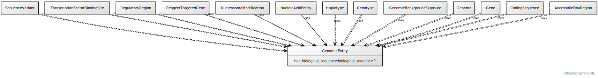

# Type: genomic entity

an entity that can either be directly located on a genome (gene, transcript, exon, regulatory region) or is encoded in a genome (protein)

URI: [biolink:GenomicEntity](https://w3id.org/biolink/vocab/GenomicEntity)

## Parents

 *  is_a: [MolecularEntity](MolecularEntity.md) - A gene, gene product, small molecule or macromolecule (including protein complex)

## Children

 * [CodingSequence](CodingSequence.md)
 * [Exon](Exon.md) - A region of the transcript sequence within a gene which is not removed from the primary RNA transcript by RNA splicing
 * [Genome](Genome.md) - A genome is the sum of genetic material within a cell or virion.
 * [Genotype](Genotype.md) - An information content entity that describes a genome by specifying the total variation in genomic sequence and/or gene expression, relative to some established background
 * [Haplotype](Haplotype.md) - A set of zero or more Alleles on a single instance of a Sequence[VMC]
 * [MacromolecularMachine](MacromolecularMachine.md) - A union of gene, gene product, and macromolecular complex. These are the basic units of function in a cell. They either carry out individual biological activities, or they encode molecules which do this.
 * [ReagentTargetedGene](ReagentTargetedGene.md) - A gene altered in its expression level in the context of some experiment as a result of being targeted by gene-knockdown reagent(s) such as a morpholino or RNAi
 * [SequenceVariant](SequenceVariant.md) - An allele that varies in its sequence from what is considered the reference allele at that locus.
 * [Transcript](Transcript.md) - An RNA synthesized on a DNA or RNA template by an RNA polymerase

## Referenced by class

 *  **[MolecularEntity](MolecularEntity.md)** *[affects expression of](affects_expression_of.md)*  0..*  **[GenomicEntity](GenomicEntity.md)**
 *  **[MolecularEntity](MolecularEntity.md)** *[affects mutation rate of](affects_mutation_rate_of.md)*  0..*  **[GenomicEntity](GenomicEntity.md)**
 *  **[MolecularEntity](MolecularEntity.md)** *[decreases expression of](decreases_expression_of.md)*  0..*  **[GenomicEntity](GenomicEntity.md)**
 *  **[MolecularEntity](MolecularEntity.md)** *[decreases mutation rate of](decreases_mutation_rate_of.md)*  0..*  **[GenomicEntity](GenomicEntity.md)**
 *  **[GenomicSequenceLocalization](GenomicSequenceLocalization.md)** *[genomic sequence localization➞object](genomic_sequence_localization_object.md)*  REQ  **[GenomicEntity](GenomicEntity.md)**
 *  **[GenomicSequenceLocalization](GenomicSequenceLocalization.md)** *[genomic sequence localization➞subject](genomic_sequence_localization_subject.md)*  REQ  **[GenomicEntity](GenomicEntity.md)**
 *  **[GenomicEntity](GenomicEntity.md)** *[has sequence location](has_sequence_location.md)*  0..*  **[GenomicEntity](GenomicEntity.md)**
 *  **[MolecularEntity](MolecularEntity.md)** *[increases expression of](increases_expression_of.md)*  0..*  **[GenomicEntity](GenomicEntity.md)**
 *  **[MolecularEntity](MolecularEntity.md)** *[increases mutation rate of](increases_mutation_rate_of.md)*  0..*  **[GenomicEntity](GenomicEntity.md)**
 *  **[SequenceVariant](SequenceVariant.md)** *[is sequence variant of](is_sequence_variant_of.md)*  0..*  **[GenomicEntity](GenomicEntity.md)**
 *  **[SequenceFeatureRelationship](SequenceFeatureRelationship.md)** *[sequence feature relationship➞object](sequence_feature_relationship_object.md)*  REQ  **[GenomicEntity](GenomicEntity.md)**
 *  **[SequenceFeatureRelationship](SequenceFeatureRelationship.md)** *[sequence feature relationship➞subject](sequence_feature_relationship_subject.md)*  REQ  **[GenomicEntity](GenomicEntity.md)**

## Attributes

### Own

 * [has biological sequence](has_biological_sequence.md)  OPT
    * Description: connects a genomic feature to its sequence
    * range: [BiologicalSequence](types/BiologicalSequence.md)

### Inherited from molecular entity:

 * [category](category.md)  1..*
    * Description: Name of the high level ontology class in which this entity is categorized. Corresponds to the label for the biolink entity type class. In a neo4j database this MAY correspond to the neo4j label tag
    * range: [CategoryType](types/CategoryType.md)
    * in subsets: (translator_minimal)
 * [id](id.md)  REQ
    * Description: A unique identifier for a thing. Must be either a CURIE shorthand for a URI or a complete URI
    * range: [String](types/String.md)
    * in subsets: (translator_minimal)
 * [name](name.md)  REQ
    * Description: A human-readable name for a thing
    * range: [LabelType](types/LabelType.md)
    * in subsets: (translator_minimal)

## Other properties

|  |  |  |
| --- | --- | --- |
| **Aliases:** | | sequence feature |
| **Mappings:** | | SO:0000110 |
|  | | GENO:0000897 |
|  | | UMLSSC:T028 |
|  | | UMLSST:gngm |
|  | | UMLSSC:T086 |
|  | | UMLSST:nusq |

