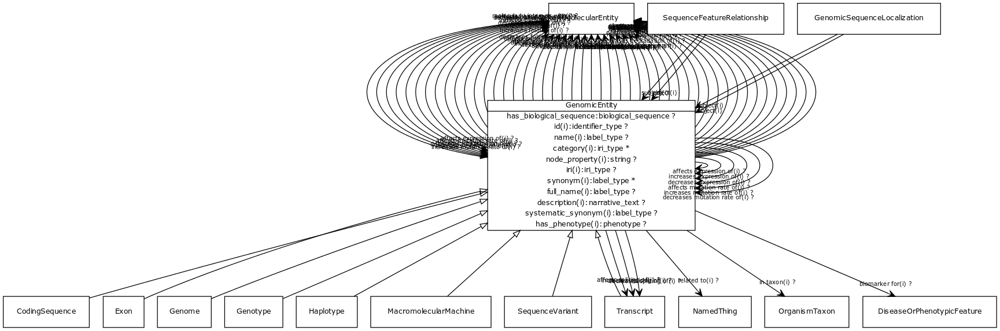

# Class: genomic entity

an entity that can either be directly located on a genome (gene, transcript, exon, regulatory region) or is encoded in a genome (protein)

URI: [http://bioentity.io/vocab/GenomicEntity](http://bioentity.io/vocab/GenomicEntity)

## Mappings

 * [SO:0000110](http://purl.obolibrary.org/obo/SO_0000110)
 * [UMLSSG:GENE](http://purl.obolibrary.org/obo/UMLSSG_GENE)
## Inheritance

 *  is_a: [MolecularEntity](MolecularEntity.md) - A gene, gene product, small molecule or macromolecule (including protein complex)
## Children

 * [CodingSequence](CodingSequence.md)
 * [Exon](Exon.md) - A region of the transcript sequence within a gene which is not removed from the primary RNA transcript by RNA splicing
 * [Genome](Genome.md) - A genome is the sum of genetic material within a cell or virion.
 * [Genotype](Genotype.md) - An information content entity that describes a genome by specifying the total variation in genomic sequence and/or gene expression, relative to some extablished background
 * [Haplotype](Haplotype.md) - A set of zero or more Alleles on a single instance of a Sequence[VMC]
 * [MacromolecularMachine](MacromolecularMachine.md) - A union of gene, gene product, and macromolecular complex. These are the basic units of function in a cell. They either carry out individual biological activities, or they encode molecules which do this.
 * [SequenceVariant](SequenceVariant.md) - An allele that varies in its sequence from what is considered the reference allele at that locus.
 * [Transcript](Transcript.md) - An RNA synthesized on a DNA or RNA template by an RNA polymerase
## Used in

 *  class: **[GenomicSequenceLocalization](GenomicSequenceLocalization.md)** *[genomic sequence localization.object](genomic_sequence_localization_object.md)* **[GenomicEntity](GenomicEntity.md)**
 *  class: **[GenomicSequenceLocalization](GenomicSequenceLocalization.md)** *[genomic sequence localization.subject](genomic_sequence_localization_subject.md)* **[GenomicEntity](GenomicEntity.md)**
 *  class: **[SequenceFeatureRelationship](SequenceFeatureRelationship.md)** *[sequence feature relationship.object](sequence_feature_relationship_object.md)* **[GenomicEntity](GenomicEntity.md)**
 *  class: **[SequenceFeatureRelationship](SequenceFeatureRelationship.md)** *[sequence feature relationship.subject](sequence_feature_relationship_subject.md)* **[GenomicEntity](GenomicEntity.md)**
## Fields

 * [has biological sequence](has_biological_sequence.md)
    * Description: connects a genomic feature to its sequence
    * range: [BiologicalSequence](BiologicalSequence.md)
    * __Local__
 * [biomarker for](biomarker_for.md) *subsets*: (translator_minimal)
    * Description: holds between a measurable molecular entity and a disease or phenotypic feature, where the entity is used as an indicator of the presence or state of the disease or feature.
    * range: [DiseaseOrPhenotypicFeature](DiseaseOrPhenotypicFeature.md)
    * inherited from: [MolecularEntity](MolecularEntity.md)
 * [category](category.md) *subsets*: (translator_minimal)
    * Description: Name of the high level ontology class in which this entity is categorized. Corresponds to the label for the biolink entity type class. In a neo4j database this MAY correspond to the neo4j label tag
    * range: [LabelType](LabelType.md)
    * inherited from: [NamedThing](NamedThing.md)
 * [description](description.md) *subsets*: (translator_minimal)
    * Description: a human-readable description of a thing
    * range: [NarrativeText](NarrativeText.md)
    * inherited from: [NamedThing](NamedThing.md)
 * [full name](full_name.md)
    * Description: a long-form human readable name for a thing
    * range: [LabelType](LabelType.md)
    * inherited from: [NamedThing](NamedThing.md)
 * [has phenotype](has_phenotype.md) *subsets*: (translator_minimal)
    * Description: holds between a biological entity and a phenotype, where a phenotype is construed broadly as any kind of quality of an organism part, a collection of these qualities, or a change in quality or qualities (e.g. abnormally increased temperature). 
    * range: [Phenotype](Phenotype.md)
    * inherited from: [BiologicalEntity](BiologicalEntity.md)
 * [id](id.md) *subsets*: (translator_minimal)
    * Description: A unique identifier for a thing. Must be either a CURIE shorthand for a URI or a complete URI
    * range: [IdentifierType](IdentifierType.md)
    * inherited from: [NamedThing](NamedThing.md)
 * [in taxon](in_taxon.md) *subsets*: (translator_minimal)
    * Description: connects a thing to a class representing a taxon
    * range: [OrganismTaxon](OrganismTaxon.md)
    * inherited from: [ThingWithTaxon](ThingWithTaxon.md)
 * [iri](iri.md) *subsets*: (translator_minimal)
    * Description: An IRI for the node. This is determined by the id using expansion rules.
    * range: [IriType](IriType.md)
    * inherited from: [NamedThing](NamedThing.md)
 * [molecularly interacts with](molecularly_interacts_with.md) *subsets*: (translator_minimal)
    * Description: holds between two entities that make physical contact as part of some interaction
    * range: [MolecularEntity](MolecularEntity.md)
    * inherited from: [MolecularEntity](MolecularEntity.md)
 * [name](name.md) *subsets*: (translator_minimal)
    * Description: A human-readable name for a thing
    * range: [LabelType](LabelType.md)
    * inherited from: [NamedThing](NamedThing.md)
 * [node property](node_property.md)
    * Description: A grouping for any property that holds between a node and a value
    * range: **string**
    * inherited from: [NamedThing](NamedThing.md)
 * [regulates, entity to entity](regulates_entity_to_entity.md) *subsets*: (translator_minimal)
    * Description: describes an entity that has a direct affect on the state or quality of another existing entity. Use of the 'affects' predicate implies that the affected entity already exists, unlike predicates such as 'affects risk for' and 'prevents, where the outcome is something that may or may not come to be.
    * range: [MolecularEntity](MolecularEntity.md)
    * inherited from: [MolecularEntity](MolecularEntity.md)
 * [related to](related_to.md)
    * Description: A grouping for any relationship type that holds between any two things
    * range: [NamedThing](NamedThing.md)
    * inherited from: [NamedThing](NamedThing.md)
 * [systematic synonym](systematic_synonym.md)
    * Description: more commonly used for gene symbols in yeast
    * range: [LabelType](LabelType.md)
    * inherited from: [NamedThing](NamedThing.md)
