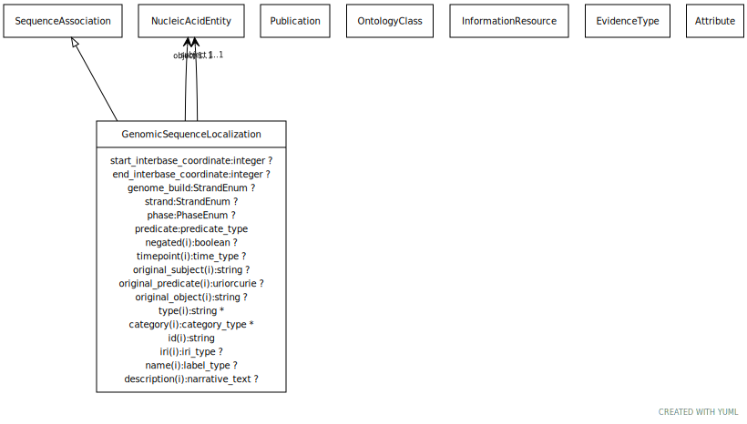

# Type: genomic sequence localization

A relationship between a sequence feature and a genomic entity it is localized to. The reference entity may be a chromosome, chromosome region or information entity such as a contig

URI: [biolink:GenomicSequenceLocalization](https://w3id.org/biolink/vocab/GenomicSequenceLocalization)

## Parents

 *  is_a: [SequenceAssociation](SequenceAssociation.md) - An association between a sequence feature and a genomic entity it is localized to.

## Referenced by class

## Attributes

### Own

 * [end interbase coordinate](end_interbase_coordinate.md)  OPT
    * Description: The position at which the subject genomic entity ends on the chromosome or other entity to which it is located on.
    * range: [Integer](types/Integer.md)
 * [genome build](genome_build.md)  OPT
    * Description: The version of the genome on which a feature is located. For example, GRCh38 for Homo sapiens.
    * range: [String](types/String.md)
 * [genomic sequence localization➞object](genomic_sequence_localization_object.md)  REQ
    * range: [GenomicEntity](GenomicEntity.md)
 * [genomic sequence localization➞relation](genomic_sequence_localization_relation.md)  REQ
    * range: [Uriorcurie](types/Uriorcurie.md)
 * [genomic sequence localization➞subject](genomic_sequence_localization_subject.md)  REQ
    * range: [GenomicEntity](GenomicEntity.md)
 * [phase](phase.md)  OPT
    * Description: The phase for a coding sequence entity. For example, phase of a CDS as represented in a GFF3 with a value of 0, 1 or 2.
    * range: [String](types/String.md)
 * [start interbase coordinate](start_interbase_coordinate.md)  OPT
    * Description: The position at which the subject genomic entity starts on the chromosome or other entity to which it is located on.
    * range: [Integer](types/Integer.md)
 * [strand](strand.md)  OPT
    * Description: The strand on which a feature is located. Has a value of '+' (sense strand or forward strand) or '-' (anti-sense strand or reverse strand).
    * range: [String](types/String.md)

### Inherited from sequence association:

 * [association type](association_type.md)  OPT
    * Description: connects an association to the type of association (e.g. gene to phenotype)
    * range: [OntologyClass](OntologyClass.md)
 * [association➞id](association_id.md)  REQ
    * Description: A unique identifier for an association
    * range: [String](types/String.md)
    * in subsets: (translator_minimal)
 * [negated](negated.md)  OPT
    * Description: if set to true, then the association is negated i.e. is not true
    * range: [Boolean](types/Boolean.md)
 * [provided by](provided_by.md)  0..*
    * Description: connects an association to the agent (person, organization or group) that provided it
    * range: [Provider](Provider.md)
 * [publications](publications.md)  0..*
    * Description: connects an association to publications supporting the association
    * range: [Publication](Publication.md)
 * [qualifiers](qualifiers.md)  0..*
    * Description: connects an association to qualifiers that modify or qualify the meaning of that association
    * range: [OntologyClass](OntologyClass.md)
