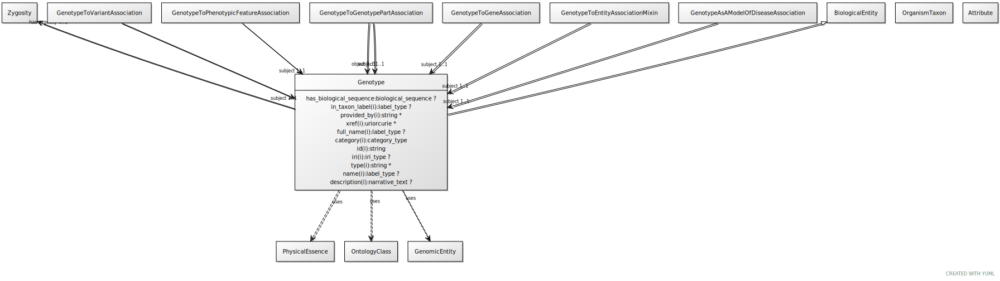

# Type: genotype

An information content entity that describes a genome by specifying the total variation in genomic sequence and/or gene expression, relative to some established background

URI: [biolink:Genotype](https://w3id.org/biolink/vocab/Genotype)

## Parents

 *  is_a: [GenomicEntity](GenomicEntity.md) - an entity that can either be directly located on a genome (gene, transcript, exon, regulatory region) or is encoded in a genome (protein)

## Referenced by class

 *  **[GenotypeAsAModelOfDiseaseAssociation](GenotypeAsAModelOfDiseaseAssociation.md)** *[genotype as a model of disease association➞subject](genotype_as_a_model_of_disease_association_subject.md)*  REQ  **[Genotype](Genotype.md)**
 *  **[GenotypeToGeneAssociation](GenotypeToGeneAssociation.md)** *[genotype to gene association➞subject](genotype_to_gene_association_subject.md)*  REQ  **[Genotype](Genotype.md)**
 *  **[GenotypeToGenotypePartAssociation](GenotypeToGenotypePartAssociation.md)** *[genotype to genotype part association➞object](genotype_to_genotype_part_association_object.md)*  REQ  **[Genotype](Genotype.md)**
 *  **[GenotypeToGenotypePartAssociation](GenotypeToGenotypePartAssociation.md)** *[genotype to genotype part association➞subject](genotype_to_genotype_part_association_subject.md)*  REQ  **[Genotype](Genotype.md)**
 *  **[GenotypeToPhenotypicFeatureAssociation](GenotypeToPhenotypicFeatureAssociation.md)** *[genotype to phenotypic feature association➞subject](genotype_to_phenotypic_feature_association_subject.md)*  REQ  **[Genotype](Genotype.md)**
 *  **[GenotypeToThingAssociation](GenotypeToThingAssociation.md)** *[genotype to thing association➞subject](genotype_to_thing_association_subject.md)*  REQ  **[Genotype](Genotype.md)**
 *  **[GenotypeToVariantAssociation](GenotypeToVariantAssociation.md)** *[genotype to variant association➞subject](genotype_to_variant_association_subject.md)*  REQ  **[Genotype](Genotype.md)**

## Attributes

### Own

 * [has zygosity](has_zygosity.md)  OPT
    * range: [Zygosity](Zygosity.md)

### Inherited from genomic entity:

 * [category](category.md)  1..*
    * Description: Name of the high level ontology class in which this entity is categorized. Corresponds to the label for the biolink entity type class. In a neo4j database this MAY correspond to the neo4j label tag
    * range: [CategoryType](types/CategoryType.md)
    * in subsets: (translator_minimal)
 * [has biological sequence](has_biological_sequence.md)  OPT
    * Description: connects a genomic feature to its sequence
    * range: [BiologicalSequence](types/BiologicalSequence.md)
 * [id](id.md)  REQ
    * Description: A unique identifier for a thing. Must be either a CURIE shorthand for a URI or a complete URI
    * range: [String](types/String.md)
    * in subsets: (translator_minimal)
 * [name](name.md)  REQ
    * Description: A human-readable name for a thing
    * range: [LabelType](types/LabelType.md)
    * in subsets: (translator_minimal)

## Other properties

|  |  |  |
| --- | --- | --- |
| **Mappings:** | | GENO:0000536 |
|  | | SIO:001079 |
| **Comments:** | | Consider renaming as genotypic entity |

