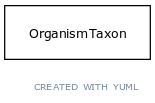

# Class: genotype

An information content entity that describes a genome by specifying the total variation in genomic sequence and/or gene expression, relative to some extablished background

URI: [http://bioentity.io/vocab/Genotype](http://bioentity.io/vocab/Genotype)

## Mappings

 * [GENO:0000536](http://purl.obolibrary.org/obo/GENO_0000536)
 * [SIO:001079](http://semanticscience.org/resource/SIO_001079)
## Inheritance

 *  is_a: [genomic entity](GenomicEntity.md) - an entity that can either be directly located on a genome (gene, transcript, exon, regulatory region) or is encoded in a genome (protein)
## Children

## Used in

## Fields

 * _[has zygosity](has_zygosity.md)_
    * range: [zygosity](Zygosity.md)
    * __Local__
 * _[related to](related_to.md)_
    * _A grouping for any relationship type that holds between any two things_
    * range: [named thing](NamedThing.md)
    * inherited from: [named thing](NamedThing.md)
 * _[molecularly interacts with](molecularly_interacts_with.md) *subsets: translator_minimal*_
    * range: [molecular entity](MolecularEntity.md)
    * inherited from: [molecular entity](MolecularEntity.md)
 * _[regulates, entity to entity](regulates_entity_to_entity.md) *subsets: translator_minimal*_
    * range: [molecular entity](MolecularEntity.md)
    * inherited from: [molecular entity](MolecularEntity.md)
 * _[biomarker for](biomarker_for.md) *subsets: translator_minimal*_
    * _holds between a measurable molecular entity and a disease or phenotypic feature, where the entity is used as an indicator of the presence or state of the disease or feature._
    * range: [disease or phenotypic feature](DiseaseOrPhenotypicFeature.md)
    * inherited from: [molecular entity](MolecularEntity.md)
 * _[in taxon](in_taxon.md) *subsets: translator_minimal*_
    * _connects a thing to a class representing a taxon_
    * range: [organism taxon](OrganismTaxon.md)
    * inherited from: [thing with taxon](ThingWithTaxon.md)
