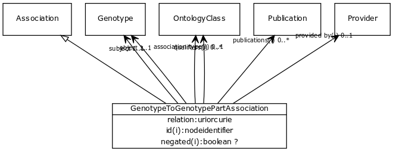

# Class: genotype to genotype part association

Any association between one genotype and a genotypic entity that is a sub-component of it

URI: [http://bioentity.io/vocab/GenotypeToGenotypePartAssociation](http://bioentity.io/vocab/GenotypeToGenotypePartAssociation)

## Mappings

## Inheritance

 *  is_a: [Association](Association.md) - A typed association between two entities, supported by evidence
## Children

## Used in

## Fields

 * [genotype to genotype part association.object](genotype_to_genotype_part_association_object.md)
    * Description: child genotype
    * range: [Genotype](Genotype.md) [required]
    * __Local__
 * [genotype to genotype part association.relation](genotype_to_genotype_part_association_relation.md)
    * Description: the relationship type by which a subject is connected to an object in an association
    * range: [RelationshipType](RelationshipType.md) [required]
    * __Local__
 * [genotype to genotype part association.subject](genotype_to_genotype_part_association_subject.md)
    * Description: parent genotype
    * range: [Genotype](Genotype.md) [required]
    * __Local__
 * [association slot](association_slot.md)
    * Description: any slot that relates an association to another entity
    * range: **string**
    * inherited from: [Association](Association.md)
 * [association type](association_type.md)
    * Description: connects an association to the type of association (e.g. gene to phenotype)
    * range: [OntologyClass](OntologyClass.md)
    * inherited from: [Association](Association.md)
 * [category](category.md) *subsets*: (translator_minimal)
    * Description: Name of the high level ontology class in which this entity is categorized. Corresponds to the label for the biolink entity type class. In a neo4j database this MAY correspond to the neo4j label tag
    * range: [IriType](IriType.md)*
    * inherited from: [NamedThing](NamedThing.md)
 * [description](description.md) *subsets*: (translator_minimal)
    * Description: a human-readable description of a thing
    * range: [NarrativeText](NarrativeText.md)
    * inherited from: [NamedThing](NamedThing.md)
 * [full name](full_name.md)
    * Description: a long-form human readable name for a thing
    * range: [LabelType](LabelType.md)
    * inherited from: [NamedThing](NamedThing.md)
 * [id](id.md) *subsets*: (translator_minimal)
    * Description: A unique identifier for a thing. Must be either a CURIE shorthand for a URI or a complete URI
    * range: [IdentifierType](IdentifierType.md)
    * inherited from: [NamedThing](NamedThing.md)
 * [iri](iri.md) *subsets*: (translator_minimal)
    * Description: An IRI for the node. This is determined by the id using expansion rules.
    * range: [IriType](IriType.md)
    * inherited from: [NamedThing](NamedThing.md)
 * [name](name.md) *subsets*: (translator_minimal)
    * Description: A human-readable name for a thing
    * range: [LabelType](LabelType.md)
    * inherited from: [NamedThing](NamedThing.md)
 * [negated](negated.md)
    * Description: if set to true, then the association is negated i.e. is not true
    * range: **boolean**
    * inherited from: [Association](Association.md)
 * [node property](node_property.md)
    * Description: A grouping for any property that holds between a node and a value
    * range: **string**
    * inherited from: [NamedThing](NamedThing.md)
 * [provided by](provided_by.md)
    * Description: connects an association to the agent (person, organization or group) that provided it
    * range: [Provider](Provider.md)
    * inherited from: [Association](Association.md)
 * [publications](publications.md)
    * Description: connects an association to publications supporting the association
    * range: [Publication](Publication.md)*
    * inherited from: [Association](Association.md)
 * [qualifiers](qualifiers.md)
    * Description: connects an association to qualifiers that modify or qualify the meaning of that association
    * range: [OntologyClass](OntologyClass.md)*
    * inherited from: [Association](Association.md)
 * [related to](related_to.md)
    * Description: A grouping for any relationship type that holds between any two things
    * range: [NamedThing](NamedThing.md)
    * inherited from: [NamedThing](NamedThing.md)
 * [systematic synonym](systematic_synonym.md)
    * Description: more commonly used for gene symbols in yeast
    * range: [LabelType](LabelType.md)
    * inherited from: [NamedThing](NamedThing.md)
