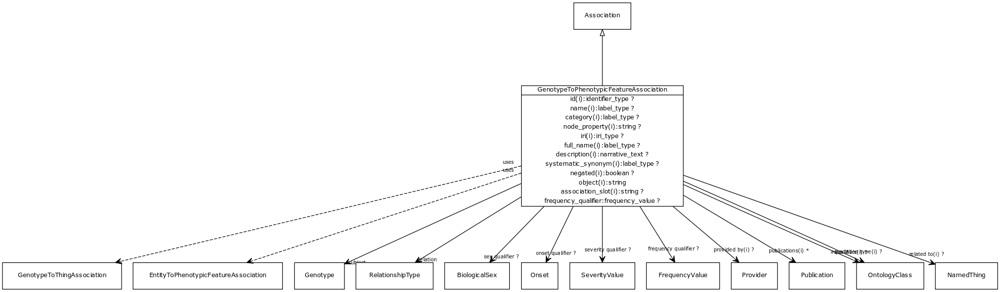

# Class: genotype to phenotypic feature association

Any association between one genotype and a phenotypic feature, where having the genotype confers the phenotype, either in isolation or through environment

URI: [http://w3id.org/biolink/vocab/GenotypeToPhenotypicFeatureAssociation](http://w3id.org/biolink/vocab/GenotypeToPhenotypicFeatureAssociation)

## Mappings

## Inheritance

 *  is_a: [Association](Association.md) - A typed association between two entities, supported by evidence
 *  mixin: [EntityToPhenotypicFeatureAssociation](EntityToPhenotypicFeatureAssociation.md)
 *  mixin: [GenotypeToThingAssociation](GenotypeToThingAssociation.md)
## Children

## Used in

## Fields

 * [genotype to phenotypic feature association.relation](genotype_to_phenotypic_feature_association_relation.md)
    * Description: the relationship type by which a subject is connected to an object in an association
    * range: [RelationshipType](RelationshipType.md) [required]
    * edge label: [has phenotype](has_phenotype.md) *subsets*: (translator_minimal)
    * __Local__
 * [genotype to phenotypic feature association.subject](genotype_to_phenotypic_feature_association_subject.md)
    * Description: genotype that is associated with the phenotypic feature
    * range: [Genotype](Genotype.md) [required]
    * __Local__
 * [association slot](association_slot.md)
    * Description: any slot that relates an association to another entity
    * range: **string**
    * inherited from: [Association](Association.md)
 * [association type](association_type.md)
    * Description: connects an association to the type of association (e.g. gene to phenotype)
    * range: [OntologyClass](OntologyClass.md)
    * inherited from: [Association](Association.md)
 * [association.id](association_id.md) *subsets*: (translator_minimal)
    * Description: A unique identifier for an association
    * range: [IdentifierType](IdentifierType.md)
    * inherited from: [Association](Association.md)
 * [entity to phenotypic feature association.description](entity_to_phenotypic_feature_association_description.md) *subsets*: (translator_minimal)
    * Description: A description of specific aspects of this phenotype, not otherwise covered by the phenotype ontology class
    * range: [NarrativeText](NarrativeText.md)
    * inherited from: [EntityToPhenotypicFeatureAssociation](EntityToPhenotypicFeatureAssociation.md)
 * [negated](negated.md)
    * Description: if set to true, then the association is negated i.e. is not true
    * range: **boolean**
    * inherited from: [Association](Association.md)
 * [object](object.md)
    * Description: connects an association to the object of the association. For example, in a gene-to-phenotype association, the gene is subject and phenotype is object.
    * range: **string** [required]
    * inherited from: [Association](Association.md)
 * [onset qualifier](onset_qualifier.md)
    * Description: a qualifier used in a phenotypic association to state when the phenotype appears is in the subject
    * range: [Onset](Onset.md)
    * inherited from: [EntityToFeatureOrDiseaseQualifiers](EntityToFeatureOrDiseaseQualifiers.md)
 * [provided by](provided_by.md)
    * Description: connects an association to the agent (person, organization or group) that provided it
    * range: [Provider](Provider.md)
    * inherited from: [Association](Association.md)
 * [publications](publications.md)
    * Description: connects an association to publications supporting the association
    * range: [Publication](Publication.md)*
    * inherited from: [Association](Association.md)
 * [qualifiers](qualifiers.md)
    * Description: connects an association to qualifiers that modify or qualify the meaning of that association
    * range: [OntologyClass](OntologyClass.md)*
    * inherited from: [Association](Association.md)
 * [severity qualifier](severity_qualifier.md)
    * Description: a qualifier used in a phenotypic association to state how severe the phenotype is in the subject
    * range: [SeverityValue](SeverityValue.md)
    * inherited from: [EntityToFeatureOrDiseaseQualifiers](EntityToFeatureOrDiseaseQualifiers.md)
 * [sex qualifier](sex_qualifier.md)
    * Description: a qualifier used in a phenotypic association to state whether the association is specific to a particular sex.
    * range: [BiologicalSex](BiologicalSex.md)
    * inherited from: [EntityToPhenotypicFeatureAssociation](EntityToPhenotypicFeatureAssociation.md)
