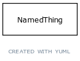

# Class: genotypic sex

An attribute corresponding to the genotypic sex of the individual, based upon genotypic composition of sex chromosomes.

URI: [http://bioentity.io/vocab/GenotypicSex](http://bioentity.io/vocab/GenotypicSex)

## Mappings

 * [PATO:0020000](http://purl.obolibrary.org/obo/PATO_0020000)
## Inheritance

 *  is_a: [biological sex](BiologicalSex.md)
## Children

## Fields

 * _[subclass of](subclass_of.md) *subsets: translator_minimal*_
    * _holds between two classes where the domain class is a specialization of the range class_
    * range: [ontology class](OntologyClass.md)
    * inherited from: [ontology class](OntologyClass.md)
