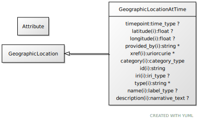

# Type: geographic location at time

a location that can be described in lat/long coordinates, for a particular time

URI: [biolink:GeographicLocationAtTime](https://w3id.org/biolink/vocab/GeographicLocationAtTime)

## Parents

 *  is_a: [GeographicLocation](GeographicLocation.md) - a location that can be described in lat/long coordinates

## Attributes

### Own

 * [timepoint](timepoint.md)  OPT
    * Description: a point in time
    * range: [TimeType](types/TimeType.md)

### Inherited from geographic location:

 * [category](category.md)  1..*
    * Description: Name of the high level ontology class in which this entity is categorized. Corresponds to the label for the biolink entity type class. In a neo4j database this MAY correspond to the neo4j label tag
    * range: [CategoryType](types/CategoryType.md)
    * in subsets: (translator_minimal)
 * [id](id.md)  REQ
    * Description: A unique identifier for a thing. Must be either a CURIE shorthand for a URI or a complete URI
    * range: [String](types/String.md)
    * in subsets: (translator_minimal)
 * [latitude](latitude.md)  OPT
    * Description: latitude
    * range: [Float](types/Float.md)
 * [longitude](longitude.md)  OPT
    * Description: longitude
    * range: [Float](types/Float.md)
 * [name](name.md)  REQ
    * Description: A human-readable name for a thing
    * range: [LabelType](types/LabelType.md)
    * in subsets: (translator_minimal)
