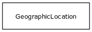

# Class: geographic location at time

a location that can be described in lat/long coordinates, for a particular time

URI: [http://bioentity.io/vocab/GeographicLocationAtTime](http://bioentity.io/vocab/GeographicLocationAtTime)

## Mappings

## Inheritance

 *  is_a: [planetary entity](PlanetaryEntity.md) - Any entity or process that exists at the level of the whole planet
## Children

## Fields

 * _[latitude](latitude.md)_
    * _latitude_
    * range: float
    * __Local__
 * _[longitude](longitude.md)_
    * _longitude_
    * range: float
    * __Local__
 * _[timepoint](timepoint.md)_
    * _a point in time_
    * range: [time type](TimeType.md)
    * __Local__
 * _[related to](related_to.md)_
    * _A grouping for any relationship type that holds between any two things_
    * range: [named thing](NamedThing.md)
    * inherited from: [named thing](NamedThing.md)
