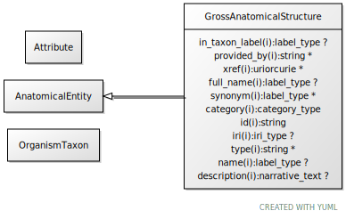

# Type: gross anatomical structure

URI: [biolink:GrossAnatomicalStructure](https://w3id.org/biolink/vocab/GrossAnatomicalStructure)

## Parents

 *  is_a: [AnatomicalEntity](AnatomicalEntity.md) - A subcellular location, cell type or gross anatomical part

## Attributes

### Inherited from anatomical entity:

 * [category](category.md)  1..*
    * Description: Name of the high level ontology class in which this entity is categorized. Corresponds to the label for the biolink entity type class. In a neo4j database this MAY correspond to the neo4j label tag
    * range: [CategoryType](types/CategoryType.md)
    * in subsets: (translator_minimal)
 * [id](id.md)  REQ
    * Description: A unique identifier for a thing. Must be either a CURIE shorthand for a URI or a complete URI
    * range: [String](types/String.md)
    * in subsets: (translator_minimal)
 * [name](name.md)  REQ
    * Description: A human-readable name for a thing
    * range: [LabelType](types/LabelType.md)
    * in subsets: (translator_minimal)

## Other properties

|  |  |  |
| --- | --- | --- |
| **Aliases:** | | tissue |
|  | | organ |
| **Mappings:** | | UBERON:0010000 |
|  | | SIO:010046 |
|  | | WIKIDATA:Q4936952 |
|  | | UMLSSC:T017 |
|  | | UMLSST:anst |
|  | | UMLSSC:T021 |
|  | | UMLSST:ffas |
|  | | UMLSSC:T023 |
|  | | UMLSST:bpoc |
|  | | UMLSSC:T024 |
|  | | UMLSST:tisu |
|  | | UMLSSC:T018 |
|  | | UMLSST:emst |

