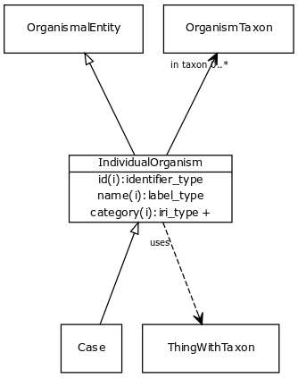

# Class: individual organism

URI: [http://bioentity.io/vocab/IndividualOrganism](http://bioentity.io/vocab/IndividualOrganism)

## Mappings

 * [SIO:010000](http://semanticscience.org/resource/SIO_010000)
 * [WD:Q795052](http://purl.obolibrary.org/obo/WD_Q795052)
 * [NCBITaxon:1](http://purl.obolibrary.org/obo/NCBITaxon_1)
## Inheritance

 *  is_a: [organismal entity](OrganismalEntity.md) - A named entity that is either a part of an organism, a whole organism, population or clade of organisms, excluding molecular entities
 *  mixin: [thing with taxon](ThingWithTaxon.md) - A mixin that can be used on any entity with a taxon
## Children

 *  child: [case](Case.md) - An individual organism that has a patient role in some clinical context.
## Used in

 *  class: [individual organism](IndividualOrganism.md) references: [case](Case.md)
## Fields

 * _[in taxon](in_taxon.md) *subsets: translator_minimal*_
    * _connects a thing to a class representing a taxon_
    * range: [organism taxon](OrganismTaxon.md)
    * __Local__
 * _[related to](related_to.md)_
    * _A grouping for any relationship type that holds between any two things_
    * range: [named thing](NamedThing.md)
    * inherited from: [named thing](NamedThing.md)
